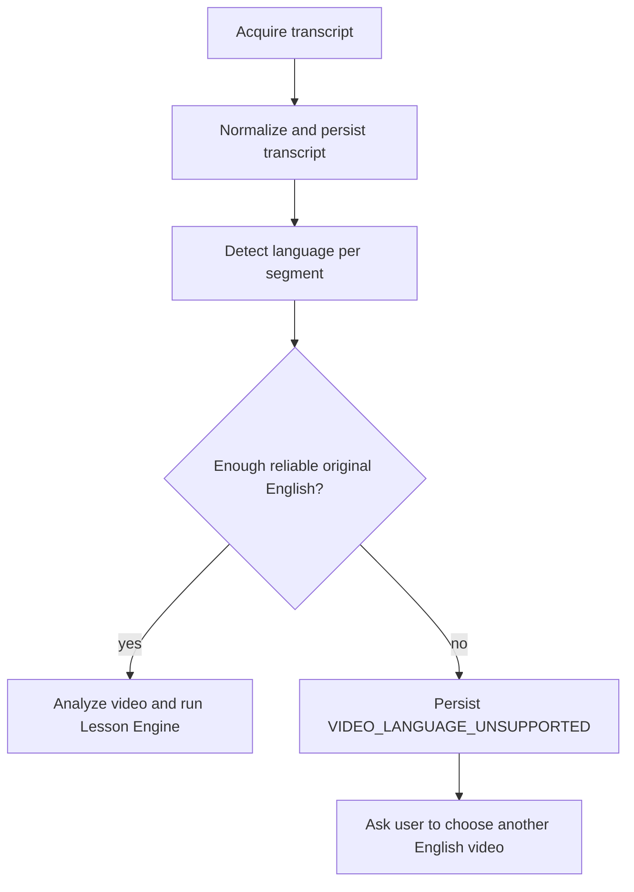

# Architecture Amendment — English-Language Eligibility Gate

**Status:** final  
**Date:** 2026-08-03  
**Authority:** This amendment binds the final Architecture Spine and overrides any interpretation that transcript acquisition success alone makes a video eligible for Lesson Engine generation.

## AD-22 — Original English is a pre-generation hard gate

- **Binds:** video eligibility, transcript normalization, Lesson Engine, errors, quota and generation workflow.
- **Prevents:** non-English videos reaching Gemini lesson-generation stages, translation-based pseudo-lessons and generated English being mistaken for source evidence.
- **Rule:** After canonical transcript commit and before `analyzing_video`, the workflow runs `LanguageEligibilityPolicy`. The job proceeds only when the source contains enough reliable, coherent original English speech for the Core Lesson contract.

Canonical state transition:

```text
normalizing_transcript
→ validating_language
   → eligible: analyzing_video
   → ineligible: failed / VIDEO_LANGUAGE_UNSUPPORTED
```

Add `validating_language` to canonical job states.

## Required port

```ts
interface LanguageEligibilityPolicy {
  evaluate(input: CanonicalTranscript): Promise<LanguageEligibilityResult>;
}
```

```ts
type LanguageEligibilityResult =
  | {
      status: "eligible";
      primaryLanguage: "en";
      eligibleEnglishSegmentIds: string[];
      excludedSegmentIds: string[];
      englishShare: number;
      coherentEnglishDurationMs: number;
      reliableEnglishWordCount: number;
      confidence?: number;
    }
  | {
      status: "ineligible";
      reason: "insufficient-original-english" | "language-confidence-too-low";
      detectedLanguages: string[];
    };
```

## Canonical transcript amendment

The transcript artifact may preserve source-language metadata per segment:

```ts
type CanonicalTranscriptSegment = {
  id: string;
  position: number;
  startMs: number;
  endMs?: number;
  text: string;
  languageCode: string;
  languageConfidence?: number;
  confidence?: number;
};
```

For lesson-generation input, only `eligibleEnglishSegmentIds` are exposed as source evidence. The full transcript may remain stored for traceability but non-English segments cannot support source quotes, listening items, grammar evidence or scored questions.

## Product error amendment

Extend `ProductError.action` with:

```text
choose_another_video
```

Canonical error:

```ts
{
  code: "VIDEO_LANGUAGE_UNSUPPORTED",
  messageVi: "Video này không có đủ nội dung tiếng Anh để tạo bài học. Hãy chọn một video chủ yếu nói tiếng Anh.",
  retryable: false,
  action: "choose_another_video"
}
```

A low-confidence language result may first offer a better transcript/audio capture when there is reason to believe the source is English. A confidently non-English result is terminal for that job.

## Workflow amendment



## Cost and quota rule

Language eligibility must execute before all expensive Lesson Engine model stages. Transcript/STT cost may already have occurred when captions were unavailable, but analyze/mine/plan/compose/review calls must not run for ineligible sources.

## Explicitly prohibited architecture

- Translation provider as a fallback for source-language eligibility.
- English TTS/dubbing pipeline for non-English videos.
- Generated English segments inside `CanonicalTranscript`.
- Any validator that permits translated/generated text to hydrate `source_quote`.

## Test additions

- English manual caption fixture passes.
- English STT fixture passes.
- Mostly English with incidental foreign phrases passes and excludes those segments.
- Mixed video with one substantial coherent English chapter may pass for that segment set.
- Mostly non-English with isolated English words fails.
- Fully non-English fails.
- Language eligibility failure proves zero Lesson Engine provider calls were made.