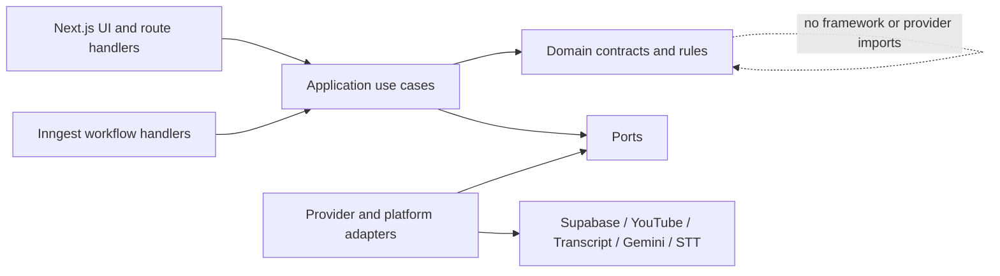
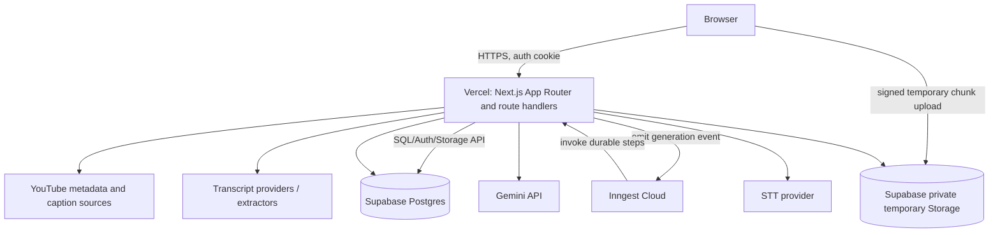
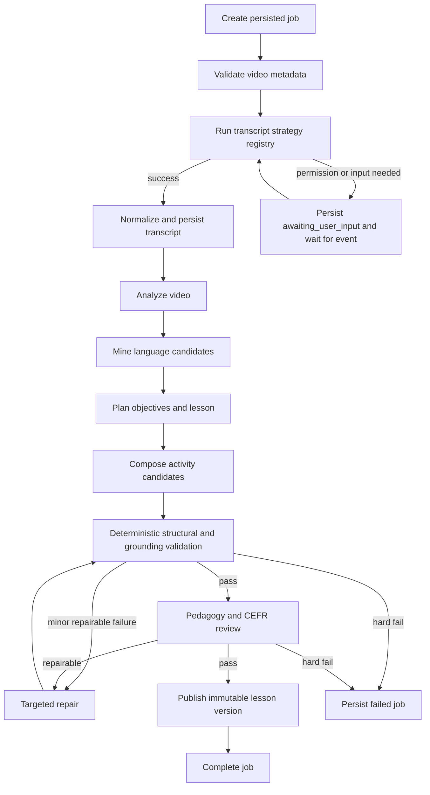
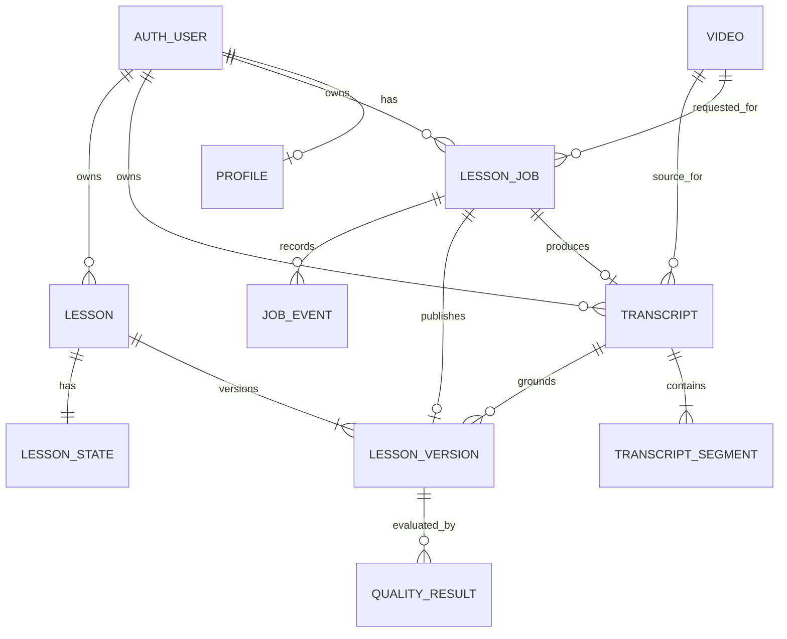

# Architecture Spine — Vidlish MVP

## Design Paradigm

**Hexagonal modular monolith with a durable workflow pipeline.**

- The deployable product is one Next.js codebase.
- Product modules own domain rules and application use cases.
- External systems are adapters behind ports.
- Inngest coordinates long-running work but does not own product state.
- Supabase Postgres is the system of record.



Dependency direction is inward. `domain` and `application` never import Next.js, Supabase, Inngest, Gemini, YouTube or a vendor SDK.

## Invariants & Rules

### AD-1 — Modular-monolith boundaries

- **Binds:** all modules and CAP-1 through CAP-12
- **Prevents:** pages, provider SDKs, database access and lesson rules collapsing into one coupled implementation.
- **Rule:** Each product module contains `domain`, `application` and `ports`; framework/platform/vendor code lives in `app`, `platform` or `adapters`. Cross-module calls use exported application contracts, never another module's repository or internal file.

### AD-2 — Postgres is product truth

- **Binds:** jobs, transcripts, lessons, completion, Library and recovery UX.
- **Prevents:** reloads, retries or serverless instance replacement losing state or producing conflicting status.
- **Rule:** User-visible product state is committed to Supabase Postgres. Browser state, function memory and Inngest step state are caches/execution aids only.

### AD-3 — Workflow owns generation transitions

- **Binds:** lesson generation and all fallback flows.
- **Prevents:** route handlers and retries skipping phases or publishing partial lessons.
- **Rule:** Only `GenerateLessonWorkflow` advances `lesson_jobs.status` and `current_stage`. HTTP handlers may create a job, cancel it or attach user-provided input; they never advance internal phases directly.

Canonical job states:

```text
queued
validating_video
acquiring_transcript
awaiting_user_input
normalizing_transcript
analyzing_video
mining_language
planning_lesson
composing_activities
validating_lesson
repairing_lesson
publishing
completed
failed
cancelled
```

### AD-4 — Durable step orchestration

- **Binds:** generation, provider retries, permission waits and long-video processing.
- **Prevents:** restarting expensive successful stages after transient failures or Vercel timeouts.
- **Rule:** Every externally visible stage is an independently retryable Inngest step with a stable step ID. A step must be idempotent or guarded by a persisted result key. Waiting for tab-audio/transcript input uses a durable event/signal rather than an open HTTP request.

### AD-5 — Provider independence

- **Binds:** video metadata, transcript acquisition, STT and lesson generation.
- **Prevents:** provider response shapes and SDKs becoming the domain model.
- **Rule:** External capabilities implement ports and return canonical domain DTOs validated at the adapter boundary. Raw provider objects never cross into application/domain code.

Required ports:

```text
VideoMetadataProvider
TranscriptStrategy
SpeechToTextProvider
LessonGenerationProvider
TemporaryArtifactStore
JobRepository
TranscriptRepository
LessonRepository
TelemetrySink
```

### AD-6 — Transcript acquisition is an ordered strategy registry

- **Binds:** PRD transcript coverage and Generation fallback UX.
- **Prevents:** `NO_CAPTIONS` becoming a dead end or product logic being hard-coded to one unofficial endpoint.
- **Rule:** The workflow asks `TranscriptAcquisitionService` to execute enabled strategies in configured priority order. Every strategy returns one of `success`, `not_applicable`, `permission_required`, `user_input_required`, `retryable_failure` or `terminal_failure`.

Supported strategy classes:

1. User-owned official caption access.
2. Existing manual/auto captions through an approved hosted provider.
3. Existing captions through a policy-gated unofficial extractor.
4. Gemini URL/audio transcription.
5. User-approved browser tab-audio capture + STT.
6. Uploaded subtitle/transcript.
7. Uploaded owned audio/video + STT.
8. Pasted transcript.

Unofficial extraction is controlled by `ENABLE_UNOFFICIAL_TRANSCRIPT_STRATEGIES`; it is not silently enabled in public production.

### AD-7 — One canonical transcript contract

- **Binds:** CAP-1, CAP-3, CAP-6, evidence links and timestamp seeking.
- **Prevents:** each source producing incompatible timing, confidence and text semantics.
- **Rule:** Every strategy must produce the same normalized transcript artifact before Lesson Engine use.

```ts
type CanonicalTranscript = {
  id: string;
  ownerUserId: string;
  videoId: string;
  sourceType:
    | "manual-caption"
    | "auto-caption"
    | "gemini-url-stt"
    | "cloud-stt"
    | "uploaded"
    | "pasted";
  sourceProvider: string;
  language: "en";
  normalizedHash: string;
  confidence?: number;
  segments: Array<{
    id: string;
    position: number;
    startMs: number;
    endMs?: number;
    text: string;
    confidence?: number;
  }>;
};
```

Segment IDs are generated after normalization and remain stable for that transcript hash. Low-confidence segments may be displayed with a warning but cannot support scored activities.

### AD-8 — Temporary audio is private and ephemeral

- **Binds:** Tab Audio Capture, owned-media upload, privacy and retention.
- **Prevents:** accidental permanent storage or public exposure of captured content.
- **Rule:** Browser audio is split into bounded chunks and uploaded through signed URLs to a private `temporary-audio` bucket. Objects carry `job_id`, `owner_user_id` and `expires_at`; they are deleted immediately after transcript commit/failure and by a scheduled TTL sweeper as defense in depth. Video/audio is never copied into permanent lesson storage.

### AD-9 — No hard duration cap; bounded work instead

- **Binds:** long videos and CAP-8.
- **Prevents:** arbitrary rejection by minutes, silent truncation, runaway cost and oversized lessons.
- **Rule:** Processing limits are expressed as semantic-window, token, segment, provider-request and per-job cost budgets. The workflow chunks deterministically and may emit an overview plus micro-lesson candidates. It must not claim the whole video was taught when only selected sections were used.

### AD-10 — Lesson Engine is multi-stage and fail-closed

- **Binds:** CAP-1 through CAP-10 and the entire Lesson Engine SPEC.
- **Prevents:** one-shot prompt output being persisted as a lesson without educational or evidence validation.
- **Rule:** Production generation follows:

```text
preprocess
→ analyze video
→ mine candidate language
→ select objectives and teachable moments
→ compose activity candidates
→ structural validation
→ grounding and answer validation
→ pedagogy/CEFR review
→ targeted repair
→ final quality gate
→ publish immutable lesson version
```

Gemini produces candidates and reviewer reports. Deterministic code owns hard gates, quote hydration, segment existence, counts, answer contracts and publish authorization.

### AD-11 — Gemini binding and version provenance

- **Binds:** `LessonGenerationProvider`, optional Gemini transcript strategy and CAP-10/CAP-11.
- **Prevents:** model aliases changing behavior without traceability or the API key leaking to browsers.
- **Rule:** The default production adapter uses stable `gemini-3.6-flash` via `@google/genai` and structured outputs. The model name is configuration, never `*-latest`; every call stores model, prompt and schema versions. `GEMINI_API_KEY` is server-only. Domain contracts remain provider-neutral.

### AD-12 — Published lesson content is immutable and versioned

- **Binds:** Library, reopen, regeneration, benchmarking and CAP-10.
- **Prevents:** provider retries or later prompt changes silently rewriting a lesson the user already studied.
- **Rule:** `lessons` owns identity and current-version pointer; `lesson_versions` stores immutable content, quality and provenance. Regeneration creates a new version. Completion/attempt state is stored separately from lesson content.

### AD-13 — Owner-scoped data and RLS

- **Binds:** auth, jobs, transcripts, lessons, temporary artifacts and Library.
- **Prevents:** one user reading or mutating another user's content through browser SDKs, guessed IDs or application bugs.
- **Rule:** Every exposed user-owned table and Storage bucket has RLS enabled with `auth.uid() = owner_user_id` policies. Server-side ownership checks remain mandatory. Service-role credentials are restricted to server adapters/workflows and never used by browser clients.

### AD-14 — Validated command, event and error contracts

- **Binds:** UI/API/workflow/provider boundaries.
- **Prevents:** drift in payloads, unsafe model/provider data and raw technical errors leaking to users.
- **Rule:** All external payloads cross Zod 4 schemas. Commands and events are versioned. User errors use:

```ts
type ProductError = {
  code: string;
  messageVi: string;
  retryable: boolean;
  action?: "retry" | "capture_audio" | "provide_transcript" | "contact_support";
  jobId?: string;
};
```

Provider errors are mapped server-side and logged with sensitive fields redacted.

### AD-15 — Idempotency, deduplication and cache keys

- **Binds:** submit/reload, provider retries and repeated lesson generation.
- **Prevents:** duplicate charges, duplicate jobs and incompatible cached results.
- **Rule:**
  - Active job key: `owner + video_id + CEFR + pipeline_version`.
  - Transcript key: `owner + normalized_hash + source_type`.
  - Lesson-generation cache key: `transcript_hash + CEFR + lesson_mode + pipeline_version + prompt_version + model_id`.
  - A cache hit is usable only when its schema and quality-gate versions match the request.

### AD-16 — Observability and reproducibility

- **Binds:** private-beta operations, quality metrics and CAP-10/CAP-12.
- **Prevents:** an unusable lesson or expensive job being impossible to diagnose or reproduce.
- **Rule:** Each job records phase start/end, safe error category, strategy/provider, request IDs, input/output token counts, cost estimate, retry count and quality result. Full transcript, prompts containing full transcript, API keys and auth tokens are never emitted to logs.

### AD-17 — Transcript and model input are untrusted

- **Binds:** all AI stages and uploaded/pasted input.
- **Prevents:** prompt injection, unsupported claims and malicious content controlling workflow behavior.
- **Rule:** Transcript content is delimited as data, never instructions. Model output cannot trigger tools, mutate state or select providers. Application code verifies segment references and enforces content/size limits before model calls.

### AD-18 — Environment and secret isolation

- **Binds:** local, staging/private-beta and production deployment.
- **Prevents:** preview code touching production data or secrets and environment-specific branches in domain code.
- **Rule:**
  - `local`: local Supabase, Inngest Dev Server and fixture providers by default.
  - `staging`: isolated Supabase project, staging Inngest environment and restricted provider keys.
  - `production`: separate Supabase project, production Inngest environment and production keys.
  - Environment-specific behavior is configuration validated at process startup; production secrets are absent from preview/local.

### AD-19 — Test pyramid and provider isolation

- **Binds:** implementation readiness and CAP-12.
- **Prevents:** flaky CI, accidental live-provider cost and prompt/model regressions reaching production.
- **Rule:**
  - Unit tests cover domain selectors, normalization, validators, error mapping and cache/idempotency.
  - Integration tests cover Postgres/RLS, repositories, Inngest workflow steps and adapters against fixtures/sandboxes.
  - Playwright E2E covers sign-in, create, fallback, generation, lesson, reopen and delete.
  - CI uses fixtures/mocks only; a separately triggered evaluation suite may call live providers.
  - Pipeline/model/prompt changes must pass the golden evaluation set before production promotion.

### AD-20 — Deletion and retention are workflow operations

- **Binds:** delete UX, transcript retention and legal release gate.
- **Prevents:** orphaned transcripts/audio and partial deletes.
- **Rule:** Deleting a lesson executes an owner-authorized transaction/workflow that removes lesson state, versions and dependent owner-scoped transcript data when no other lesson depends on it. Temporary audio is always removed regardless of lesson outcome. Audit metadata may retain non-content identifiers only according to the published retention policy.

## Consistency Conventions

| Concern | Convention |
| --- | --- |
| Module names | Lowercase kebab-case directories; domain types in PascalCase; ports end in `Provider`, `Repository` or `Store`. |
| IDs | Postgres UUIDs; opaque to clients; never encode user/video metadata. |
| Dates | Postgres `timestamptz`; API uses UTC ISO 8601 strings. |
| Durations | Milliseconds in domain/API fields (`startMs`, `endMs`); minutes only for user-facing estimates. |
| Events | Lowercase namespaced past-tense names, e.g. `lesson.generation-requested.v1`, `transcript.input-provided.v1`. |
| Commands | Imperative application DTOs, e.g. `CreateLessonJob`, `ProvideTranscriptInput`, `DeleteLesson`. |
| Database | SQL migrations are append-only and reviewed; direct production schema editing is forbidden. |
| Lesson JSON | Versioned domain schema; JSONB persists the validated immutable lesson document, while searchable ownership/status fields remain relational columns. |
| Errors | Stable uppercase product codes; Vietnamese user copy; provider detail only in redacted server logs. |
| Logging | Structured JSON with `request_id`, `job_id`, `user_id_hash`, `phase`, `provider` and `duration_ms`; no content bodies. |
| Config | One typed config module validates environment variables at startup; modules do not read `process.env` directly. |
| Auth | Cookie-based Supabase SSR session; server verifies user on every command; RLS is mandatory defense in depth. |
| UI data reads | Server Components for initial authenticated reads; Client Components only for player, capture, activities and polling interactions. |
| Mutations | Route handlers/application commands; browser never writes lesson/transcript tables directly. |
| Progress | UI reads persisted `lesson_jobs`; transport is polling in MVP and may change without changing the state model. |

## Stack

Verified against official documentation on 2026-08-03. Exact patch versions are locked in `pnpm-lock.yaml` when the application is scaffolded.

| Name | Version |
| --- | --- |
| Node.js | 24 LTS |
| Next.js | 16.x, App Router |
| React | 19.x, Next.js-managed |
| TypeScript | 6.0 |
| pnpm | 10.x |
| Tailwind CSS | 4.x |
| shadcn/ui | current copy-in components at scaffold |
| Zod | 4.x |
| Supabase Postgres/Auth/Storage | hosted platform |
| `@supabase/supabase-js` | 2.x |
| `@supabase/ssr` | lockfile-pinned current release |
| Inngest TypeScript SDK | 4.x |
| Gemini API | stable `gemini-3.6-flash` |
| `@google/genai` | 1.x, lockfile-pinned |
| Vitest | 4.1.x |
| Playwright | current stable, lockfile-pinned |
| Vercel Functions | Fluid compute |

## Structural Seed

### Runtime topology



### Generation workflow



### Core ownership model



### Source tree

```text
src/
  app/                         # Next.js routes, layouts, route handlers and UI composition
  modules/
    identity/                  # auth-facing application contracts
    video/                     # URL parsing, metadata and eligibility
    transcript/                # canonical transcript and acquisition orchestration
    lesson-engine/             # selection, pipeline contracts, validators and quality gates
    lessons/                   # lesson identity/version application use cases
    library/                   # owner-scoped listing, completion and deletion
  workflows/
    generate-lesson/           # Inngest function and stable step definitions
    retention/                 # temporary artifact sweeper and deletion workflows
  adapters/
    youtube/                   # metadata/caption implementations
    transcript/                # hosted, unofficial, Gemini URL and user-input strategies
    stt/                       # cloud STT implementations
    gemini/                    # @google/genai LessonGenerationProvider
    supabase/                  # repositories, auth and temporary artifact store
  platform/
    config/                    # typed environment configuration
    inngest/                   # client, events and serve registration
    telemetry/                 # structured logging and metrics
  shared/
    contracts/                 # cross-boundary Zod schemas and versioned events
    errors/                    # ProductError mapping
    testing/                   # fixtures and provider fakes
supabase/
  migrations/
  seed.sql
  tests/                       # RLS and database contract tests
tests/
  integration/
  e2e/
  evaluation/                  # golden videos, expectations and score reports
```

## Capability → Architecture Map

| Capability / Area | Lives in | Governed by |
| --- | --- | --- |
| CAP-1 Video analysis | `modules/video`, `modules/lesson-engine`, Gemini adapter | AD-1, AD-5, AD-10, AD-17 |
| CAP-2 Learning outcomes | `modules/lesson-engine` planner | AD-10, Lesson Engine SPEC |
| CAP-3 Teachable moments | selector and language-miner contracts | AD-7, AD-10, AD-19 |
| CAP-4 CEFR personalization | CEFR rubric and planner/composer | AD-10, AD-11, AD-19 |
| CAP-5 Core Lesson progression | lesson schema and composer | AD-10, AD-12 |
| CAP-6 Grounding | canonical segments, grounding validator | AD-7, AD-10, AD-17 |
| CAP-7 Exercise validity | activity contracts and answer validator | AD-10, AD-14, AD-19 |
| CAP-8 Long-video scaling | chunk planner and workflow | AD-4, AD-9 |
| CAP-9 Quality gate | deterministic validators, reviewer, repair | AD-10, AD-19 |
| CAP-10 Traceability/versioning | lesson versions, provenance and telemetry | AD-11, AD-12, AD-16 |
| CAP-11 Provider independence | ports and adapters | AD-1, AD-5, AD-11 |
| CAP-12 Benchmark quality | `tests/evaluation` and promotion gate | AD-16, AD-19 |
| Transcript coverage | transcript module and strategy registry | AD-4, AD-6, AD-7, AD-8 |
| Auth/data isolation | identity, Supabase repositories/RLS | AD-2, AD-13, AD-18 |
| Create/Generation UX | app routes + persisted job reads | AD-2, AD-3, AD-4, AD-15 |
| Library/delete | lessons/library modules and retention workflow | AD-12, AD-13, AD-20 |

## Deferred

- Exact hosted transcript provider, STT provider and commercial plan: choose when API accounts/budget are supplied; contracts and required capabilities are fixed here.
- Direct browser-to-STT streaming with ephemeral vendor tokens: optimize after chunked temporary upload works reliably.
- Supabase Realtime for job progress: polling is the MVP transport.
- Chrome extension, desktop companion and on-device Whisper: post-MVP acquisition adapters.
- Independently deployed extractor or worker service: split from the monolith only after measured IP/runtime/scale constraints justify it.
- Search, embeddings, RAG and long-term learner vocabulary model: outside MVP.
- Detailed answer history, adaptive sequencing and spaced repetition: outside MVP.
- Payment, subscriptions, public sharing, classroom and teacher features: outside MVP.
- Public-launch Terms, Privacy Policy and final transcript-retention language: legal release gate.
- Email/push completion notifications: add only if beta data shows users regularly leave long jobs and fail to return.
