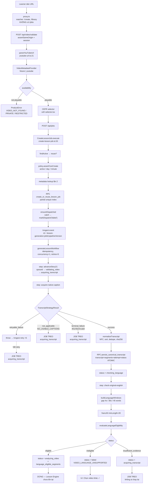

# Vidlish — Phân tích toàn bộ repository (2026-08-05)

> Tài liệu này là **advisory**, không normative. Nó không thay thế PRD, Architecture Spine,
> Lesson Engine SPEC hay `epics.md`. Mọi đề xuất thay đổi artifact nằm ở mục 13 và chưa được áp dụng.

Phân tích tại commit `f1387be` (`docs: mark Story 2.3 done`). Mọi nhận định dẫn chứng bằng `file:line`.

---

## 1. Executive summary

Vidlish có nền tảng kỹ thuật tốt hơn mức trung bình rất nhiều cho một dự án ở giai đoạn này:
hexagonal boundaries sạch, Zod contracts strict ở mọi mép, SQL với RLS + `security definer` RPC +
pgTAP thật, fail-closed config, và một language-eligibility gate được thiết kế nghiêm túc.
Epic 1 và Story 2.1–2.3 là code production thật, không phải scaffold.

Nhưng có một lỗ hổng duy nhất, nghiêm trọng, làm sản phẩm chưa thể dùng được với video thật:

> **Pipeline không có trạng thái kết thúc cho bất kỳ thất bại nào ngoài "video không đủ tiếng Anh".**

Không có một dòng code TypeScript nào ghi `status = 'failed'`. Video không có caption, provider
timeout hết retry, provider trả 401/402, hoặc evidence quá yếu → job nằm vĩnh viễn ở
`acquiring_transcript`, và UI poll 3 giây/lần mãi mãi
(`src/adapters/inngest/generate-lesson-workflow.ts:66-94`,
`src/app/(protected)/jobs/[jobId]/_components/job-progress.tsx:82-97`).
Nút "Thử lại" duy nhất trên trang chỉ hoạt động khi `dispatchStatus === "failed"` và không thể
khởi động lại workflow đã dispatch.

Ba khoảng cách lớn còn lại:

- **Lesson Engine: 0 dòng code.** SPEC rất đầy đủ (`_bmad-output/specs/spec-vidlish-lesson-engine/`)
  nhưng không có port, không có schema DB, không có migration lesson.
- **Chỉ 1 transcript strategy.** Registry/waterfall mà toàn bộ research và UX giả định
  (`EXPERIENCE.md:115-121`) chưa tồn tại — `TranscriptStrategy` bị hard-lock vào literal
  `"supadata-native-caption"` (`src/modules/transcript/ports/transcript-strategy.ts:4`).
- **Chưa có provider production nào từng chạy thật.** CI 100% fixtures
  (`.github/workflows/ci.yml:19-34`). Supadata, YouTube Data API, Inngest Cloud chưa có staging
  evidence trong bất kỳ artifact nào.

**Story tiếp theo đúng nhất không phải 2.4.** Nó là một story mới: *Transcript strategy registry +
kết thúc an toàn/khôi phục được* — vì mọi strategy thêm vào sau (2.4, 2.6, 2.7, 2.8) sẽ kế thừa
nguyên vẹn lỗ hổng này nếu không sửa trước.

---

## 2. Product definition — Vidlish thực chất là gì

### Vấn đề

Người Việt học tiếng Anh có sẵn nội dung họ *muốn* xem (YouTube), nhưng xem thụ động không tạo ra
học tập. Khoảng cách không phải là "thiếu nội dung" mà là **thiếu sự chuyển hóa nội dung thành
thiết kế học tập**: chọn cái gì đáng học, ở mức nào, và làm sao kiểm chứng đã học được
(`IDEA.md:17-22`).

### Người dùng mục tiêu ban đầu

Người Việt tự học, A1–C1, không có giáo viên, đã có thói quen xem YouTube tiếng Anh
(`IDEA.md:36-40`). Private beta là allowlist email do server quản lý
(`supabase/migrations/20260803170000_create_beta_access.sql:1-16`).

### Jobs to be done

1. "Tôi muốn video này *dạy* tôi, không chỉ giải trí."
2. "Cho tôi biết trong 20 phút này cái gì đáng nhớ."
3. "Kiểm tra xem tôi có thật sự hiểu không."
4. "Đừng bắt tôi tự làm ghi chú và flashcard."

### Khác biệt so với các lựa chọn khác

| Lựa chọn | Vidlish khác ở đâu |
|---|---|
| YouTube + phụ đề | Phụ đề là *hỗ trợ hiểu*, không phải *thiết kế học*. Vidlish tạo objectives, progression, activity có đáp án (`lesson-schema.md:12-31`) |
| ChatGPT + dán transcript thủ công | Không có grounding cưỡng chế, không có CEFR rubric có version, không có quality gate deterministic, không lưu tiến độ. Vidlish cấm publish khi segment ID không tồn tại (`lesson-schema.md:272-283`) |
| FluentU | Thư viện đóng, biên tập sẵn. Vidlish là **video người dùng tự chọn** |
| LingQ | Tập trung đọc/nhặt từ, người học tự chọn từ. Vidlish có **selection algorithm** chấm teaching value và tự loại proper noun/thuật ngữ (`generation-quality-pipeline.md:120-124`) |
| Language Reactor | Lớp phụ đề + tra từ theo thời gian thực. Vidlish là **artifact bài học bền vững**, mở lại được, có tiến độ |
| Công cụ AI "tạo bài học" thông thường | Chúng dùng `transcript → 1 prompt → lesson`. Vidlish **cấm** đúng pattern đó (`generation-quality-pipeline.md:21-26`) |

### Khác biệt phòng thủ được nhất

Không phải "AI tạo bài học" — ai cũng làm được. Là **grounding cưỡng chế + eligibility gate**:
Vidlish từ chối tạo bài học từ video không đủ tiếng Anh gốc và từ chối publish nội dung không truy
nguyên được về segment ID. Đây là ràng buộc sản phẩm mà đối thủ dùng one-shot LLM không có. Nó đã
được implement thật ở tầng ngôn ngữ
(`supabase/migrations/20260804031500_create_language_eligibility.sql:174-217` — DB tự kiểm tra mọi
segment ID và bắt buộc permitted ∪ excluded phủ kín transcript).

### Lý do quay lại

Chưa có gì trong code hỗ trợ retention: library là placeholder tĩnh
(`src/app/(protected)/library/page.tsx:10-14`). Về thiết kế: lịch sử bài học + tiến độ +
"video bạn chọn" là vòng lặp (`IDEA.md:399-403`, giả thuyết #4).

### "Aha moment"

**Lần đầu người dùng dán một video họ đã xem rồi, và thấy Vidlish trích đúng câu, đúng cụm từ họ đã
*nghe không kịp*, kèm timestamp bấm được.** Không phải summary — summary thì ChatGPT làm được.
Là *"nó nghe được cái tôi bỏ lỡ"*. Điều này đòi hỏi grounding + timestamp navigation (Story 4.1),
tức là aha moment thật nằm sau Epic 3 + 4.1, không phải sau Epic 3.

---

## 3. Current implementation status

### Bảng trạng thái thực tế

| Story | Mục tiêu | Đã triển khai | Provider production | Test hiện có | Rủi ro còn lại | Trạng thái thực tế | Điều kiện đánh dấu hoàn thành |
|---|---|---|---|---|---|---|---|
| **1.1** Email OTP + private beta | Đăng nhập an toàn, allowlist | Supabase OTP adapter, `beta_access` RLS, proxy session, sign-in flow | Supabase Auth **chưa chạy hosted** (CI dùng `AUTH_ADAPTER=fake`) | unit `identity-service.test.ts`, e2e `tests/e2e/auth.spec.ts` (6 case), pgTAP `beta_access_rls.test.sql` | Template OTP hosted chưa cấu hình (`README.md:32`); proxy matcher bỏ sót `/jobs` | **CI-only / staging-ready** | 1 lần OTP thật trên hosted Supabase + template `{{ .Token }}` |
| **1.2** URL + metadata validation | Parse URL, kiểm playability | `parseYouTubeUrl` (watch/shorts/embed/youtu.be), YouTube Data API adapter + mapper, canonical availability | `VIDEO_METADATA_ADAPTER=youtube` tồn tại nhưng **chưa chạy thật** | unit URL/mapper/provider, e2e `video-metadata.spec.ts` | Quota YouTube API chưa đo; `captionAvailable`/`declaredAudioLanguage` lấy về rồi **vứt đi** | **CI-only** | 1 lần gọi `videos.list` thật với key staging |
| **1.3** CEFR + confirm draft | Chọn A1–C1, xác nhận draft | `cefr-selector.tsx`, invalidation rules | n/a | unit `cefr-selector.test.ts`, e2e | Không có giải thích CEFR cho người mới | **Production-ready** (thuần client) | — |
| **2.1** Durable generation job | Job bền vững, idempotency, quota | `CreateLessonJob`, `GenerationPolicy`, partial unique index, RPC `create_or_reuse_lesson_job`, progress page | Supabase repo + Inngest dispatcher tồn tại; **Inngest Cloud chưa chạy** | unit ×8, pgTAP `generation_jobs_rls.test.sql` | Dispatch fail → job mồ côi nếu user đóng tab; quota TOCTOU; day boundary UTC | **CI-only** | Inngest Cloud + signing key + 1 job thật end-to-end |
| **2.2** Native caption → canonical transcript | Fast path + normalize + persist atomic | `SupadataNativeCaptionStrategy`, `normalizeTranscript`, RPC `persist_canonical_transcript` | Supadata adapter code hoàn chỉnh, **API key chưa từng dùng** | unit adapter (mock fetch), normalize ×3, acquire ×4, pgTAP `canonical_transcripts.test.sql` (14 assert) | `translationStatus` **luôn** `"unknown"` từ provider thật → nhánh chống caption dịch là dead code ngoài fixture; `NO_USABLE_CAPTIONS` không có terminal state | **CI-only, có lỗ hổng thiết kế** | Supadata thật + xác minh `mode=native` không trả track dịch |
| **2.3** Original-English gate | Chặn video không đủ tiếng Anh | `buildLanguageWindows`, `FrancLanguageAnalysisAdapter`, `evaluateLanguageEligibility`, RPC `persist_language_eligibility` | `franc-min` chạy **local, không cần provider** → phần **duy nhất production-ready thật** | unit ×4 policy, ×2 window, ×3 orchestration, pgTAP `language_eligibility.test.sql` (20 assert), e2e ×2 | `englishShare` chia cho reliable duration → false positive; ngưỡng chưa hiệu chỉnh; `insufficient_evidence` → vòng lặp chết | **Production-ready về runtime, chưa hiệu chỉnh** | 30–50 video thật đo false positive/negative |
| **2.4–2.13** | Fallback, quota, telemetry, retention | **Không có gì** | — | — | — | **Chưa bắt đầu** | — |
| **Epic 3** (Lesson Engine) | Bài học có căn cứ | **Không có gì.** Không port, không schema, không migration | — | — | SPEC hoàn chỉnh nhưng chưa chọn model provider | **Chỉ có planning artifact** | — |
| **Epic 4, 5** | Học tương tác, thư viện | `library/page.tsx` là placeholder tĩnh | — | — | — | **Chưa bắt đầu** | — |

### Phân loại rõ ràng

- **Production code (chạy thật được ngay):** toàn bộ `src/modules/**`, `src/shared/**`,
  `supabase/migrations/**`, adapter `franc`.
- **Fake/fixture:** `src/adapters/fake/**` (7 file) + `fixture-video-metadata-provider.ts`.
  Bị chặn ở production bằng `superRefine` (`src/platform/config/server.ts:30-51`) — cơ chế này tốt
  và đúng, nhưng lưu ý: escape hatch `CI=true` vô hiệu hóa mọi chặn (`server.ts:31`), nên `CI=true`
  không được lọt vào production.
- **Local-only:** `INNGEST_DEV=1` + inline dispatcher.
- **CI-only:** mọi adapter provider (Supadata, YouTube, Inngest, Supabase Auth) — code có, chưa chạy thật.
- **Staging-ready:** kiến trúc config đã sẵn sàng chuyển; thiếu credentials + 1 lần chạy có bằng chứng.
- **Production-ready:** chỉ `franc` language analysis + toàn bộ SQL layer (có pgTAP chạy trên
  Postgres thật trong CI job `database`, `.github/workflows/ci.yml:56-73`).

**Quan trọng:** `sprint-status.yaml` đánh dấu 2.1/2.2/2.3 = `done`, và story artifact ghi
"Final CI passed". Điều đó đúng theo định nghĩa DoD hiện tại của dự án (fixtures + CI), nhưng
**không phải bằng chứng production**. Không story nào có mục "staging evidence".

---

## 4. Architecture map

### Luồng đầy đủ hiện tại



### Từng chặng, có dẫn chứng

| Chặng | File | Trạng thái |
|---|---|---|
| Authentication | `src/adapters/supabase/supabase-identity-provider.ts`, `src/proxy.ts` | ✅ đầy đủ |
| Private-beta admission | `src/modules/identity/application/identity-service.ts:36-47` | ✅ đúng — không lộ tồn tại tài khoản |
| Video URL parsing | `src/modules/video/domain/youtube-url.ts:21-61` | ✅ chặt (reject userinfo, multi-`v`, host lạ) |
| YouTube metadata | `src/adapters/youtube/youtube-metadata-mapper.ts:55-97` | ✅ code đủ, chưa chạy thật |
| Create draft | `src/app/(protected)/create/**` | ✅ |
| Generation job | `src/modules/generation/application/create-lesson-job.ts` | ✅ |
| Inngest dispatch | `src/adapters/inngest/generation-dispatcher.ts` | ⚠️ event id ổn, nhưng lỗi bị nuốt |
| Transcript acquisition | `src/modules/transcript/application/acquire-native-caption.ts` | ⚠️ 1 strategy, không có registry |
| Transcript persistence | `supabase/migrations/20260804024500_create_canonical_transcripts.sql:155-308` | ✅ atomic thật, `for update of lesson_jobs` |
| Language analysis | `src/adapters/franc/franc-language-analysis-adapter.ts` | ✅ |
| Eligibility policy | `src/modules/language/application/evaluate-language-eligibility.ts` | ⚠️ mẫu số sai (mục 6) |
| Fallback strategies | — | ❌ **không tồn tại** |
| Lesson generation | — | ❌ **không tồn tại** |
| Lesson persistence | — | ❌ **không có bảng `lessons`** |
| Lesson presentation | — | ❌ |
| Progress tracking | `job-progress.tsx` (poll 3s) | ⚠️ không có stall detection |
| Error handling | `src/shared/errors/product-error.ts` | ⚠️ thiếu mã cho transcript exhaustion |
| Retry & idempotency | Inngest key + partial unique index + `attempt_key` unique | ✅ ở tầng DB, ⚠️ ở tầng workflow |

---

## 5. Đánh giá kiến trúc

### Điểm mạnh

1. **Boundary kỷ luật.** `src/modules/*/ports` chỉ chứa interface; adapter không rò rỉ vào domain.
   `evaluate-language-eligibility.ts` không import gì từ adapter.
2. **SQL là tầng phòng thủ cuối, không phải chỗ chứa dữ liệu.** `persist_language_eligibility` tự
   kiểm tra: window evidence không được chứa `text` (`language_eligibility.sql:159-165`), mọi
   segment ID phải thuộc transcript (`:174-203`), permitted ∪ excluded phải phủ kín (`:205-217`).
3. **Fail-closed config với production rejection thật.** `server.ts:30-61` — 6 rule chặn fake adapter.
4. **Idempotency ở đúng tầng.** Partial unique index (`generation_jobs.sql:63-65`) chứ không chỉ dựa
   event dedup — README nói đúng điều này (`README.md:90`).
5. **Server-only enforcement.** `import "server-only"` ở mọi adapter chạm secret.
6. **Ownership scoping nhất quán** ở mọi read path (`findOwnedById(jobId, ownerUserId)`).

### Điểm yếu / technical debt

#### D1 — Không có terminal state cho thất bại transcript (nghiêm trọng nhất)

```
src/adapters/inngest/generate-lesson-workflow.ts:66-94
src/platform/generation/create-generation-runtime.ts:43-45   // return; im lặng
```

`grep '"failed"'` trên toàn `src/` cho thấy **không một lời gọi `updateStatus(..., "failed", ...)`** nào.
Ba hệ quả: `NO_USABLE_CAPTIONS` → treo; `terminal_failure` (401/402/`PROVIDER_RESPONSE_INVALID`) → treo;
hết 5 lần Inngest retry → function failed nhưng job DB vẫn `acquiring_transcript` → treo.

Và không có mã lỗi sản phẩm nào cho tình huống này: `productErrorCodeSchema`
(`product-error.ts:3-24`) không có `TRANSCRIPT_UNAVAILABLE`.

#### D2 — Nút "Thử lại" không thể khởi động lại workflow

`job-progress.tsx:99-126` gọi `POST /api/jobs`, đi vào `findActive` → `ensureDispatched` →
`if (job.dispatchStatus === "sent") return;` (`create-lesson-job.ts:40`). Job đã dispatch nhưng
treo **không có đường phục hồi qua UI**. Thêm nữa,
`idempotency: 'event.data.jobId + "-" + event.data.pipelineVersion'`
(`generate-lesson-workflow.ts:28`) khiến event mới bị Inngest loại bỏ trong cửa sổ dedupe — cần xác
minh chính xác cửa sổ này với Inngest, nhưng thiết kế hiện tại giả định "chỉ chạy một lần, không
bao giờ cần chạy lại".

#### D3 — Vòng lặp chết ở `insufficient_evidence`

`language_eligibility.sql:308-316` đặt job về `acquiring_transcript` để "fallback strategy sau tiếp
tục". Nhưng: (a) không có fallback strategy; (b) workflow đã ở step cuối, không quay lại;
(c) report có `unique (job_id, transcript_id, detector_version, policy_version)` nên chạy lại cùng
transcript cho cùng kết quả. Đây là thiết kế đúng cho tương lai, nhưng hôm nay là bug.

#### D4 — Abstraction quá chặt ở chỗ cần mở, quá lỏng ở chỗ cần chặt

- **Quá chặt:** `TranscriptStrategy.id` là literal type `"supadata-native-caption"`
  (`transcript-strategy.ts:4`); `TranscriptAttemptRecord.provider` là `"supadata"`
  (`transcript-repository.ts:11`); DB có `check (provider = 'supadata')`
  (`canonical_transcripts.sql:19`). Thêm strategy thứ 2 = migration + đổi type ở 6 file.
- **Quá lỏng:** `advanceStory21(jobId)` — **số hiệu story rò vào domain port**
  (`generation-job-repository.ts:36`). Port mô tả *khi nào nó được viết*, không phải *nó làm gì*.

#### D5 — Telemetry nói dối trong local/CI

`acquire-native-caption.ts:71` hard-code `provider: "supadata"` khi ghi attempt, kể cả khi
`FixtureNativeCaptionStrategy` vừa chạy.

#### D6 — Architecture tests là regex trên source code

`tests/integration/language-gate-contract.test.ts`, `tests/integration/sql-contract.test.ts` — đọc
file bằng `readFileSync` rồi `expect(...).toMatch(/regex/)`. Ví dụ
`expect(evaluator).not.toMatch(/declaredLanguage/)` sẽ pass ngay cả khi logic sai hoàn toàn.
Đây là false confidence, không phải test.

#### D7 — Dead code / trạng thái không dùng

- `awaiting_user_input`: có trong enum TS + SQL, không bao giờ được ghi.
- `cancelled`: không có API cancel nào (`grep -i cancel` → 0 kết quả ngoài enum).
- `videoErrors.languageUnsupported()`: chỉ được dùng trong chính test của nó.
- `captionAvailable`, `declaredAudioLanguage`: lấy từ YouTube API rồi vứt.

### Race conditions

| Nơi | Mô tả | Mức độ |
|---|---|---|
| `create-lesson-job.ts:57-83` | `findActive` → `getPolicySnapshot` → `createOrReuse` là 3 round-trip không transaction. Hai request song song đều pass quota | **Thấp** — unique index chặn duplicate job; quota chỉ vượt bằng đúng số request đồng thời |
| `acquire-native-caption.ts:107-118` | `updateStatus('normalizing_transcript')` rồi mới `persistAndAdvance`. Hai write riêng | **Thấp** — retry vào lại được vì status này không nằm trong `downstreamStatuses` (`:21-33`). Nhưng README nói "atomic" — đúng cho RPC, không đúng cho cặp write này |
| `ensureDispatched` (`:39-51`) | Nếu `send()` thành công nhưng `markDispatch('sent')` fail → catch ghi `'failed'` | **Thấp** — Inngest idempotency + unique index chặn duplicate |

### Nguy cơ mất dữ liệu

- `normalizeTranscript` **âm thầm bỏ** chunk có `durationMs <= 0` (`normalize-transcript.ts:47-54`).
  Schema cho phép `durationMs: nonnegative` tức 0 hợp lệ. Không log, không đếm, không cảnh báo.
- `.replace(/ *\n+ */g, " ")` (`:20`) nhập dòng thành khoảng trắng — mất ranh giới câu trong caption
  nhiều dòng, ảnh hưởng downstream (câu trích, cloze).

### Nguy cơ duplicate job

Được kiểm soát tốt: partial unique index + `on conflict do nothing` + RPC trả `created` boolean, có
pgTAP chứng minh (`canonical_transcripts.test.sql:123-124`).

### Vendor lock-in

- **Supadata:** lock-in ở tầng **DB constraint** (`check (provider = 'supadata')`), tệ hơn lock-in ở
  tầng code. Nợ cần trả trước Story 2.4.
- **Inngest:** vừa phải — `GenerationDispatcher` port có thật, nhưng semantics retry/idempotency gắn chặt.
- **Supabase:** sâu và cố ý (RPC `security definer` là kiến trúc). Chấp nhận được cho MVP.
- **franc-min:** thấp — port sạch, nhưng `detectorVersion` là literal `"franc-min:6.2.0"` trong Zod
  **và** DB check → nâng version = migration.

### Nguy cơ tăng chi phí

- **Không có giới hạn thời lượng video ở bất cứ đâu.** `durationMs` được lưu, không được kiểm tra.
  Một video 6 tiếng đi thẳng vào Supadata rồi (tương lai) vào LLM. Story 2.9 xử lý việc này nhưng
  đang ở backlog.
- `chunks: z.array(...).max(100_000)` với `text: max 20_000` → giới hạn lý thuyết 2GB payload.
- Quota theo ngày dùng **UTC boundary** (`generation-job-repository.ts:110-111`) — người dùng VN
  reset lúc 7h sáng, không phải nửa đêm.

### Supabase RLS & service-role — đánh giá riêng

✅ **Đúng chuẩn.** Mọi bảng: `enable row level security` + `revoke all from public, anon, authenticated`
+ `grant select to authenticated` + policy `auth.uid() = owner_user_id`. Mọi write đi qua
`security definer` function với `set search_path = public` và `grant execute ... to service_role`
(đã `revoke` khỏi `authenticated`). pgTAP kiểm chứng cross-owner invisibility
(`canonical_transcripts.test.sql:155`, `language_eligibility.test.sql:319-320`).

⚠️ Một điểm: app đọc job qua **admin client** (`createGenerationRepository()` →
`getAdminSupabaseClient()`), tự lọc `owner_user_id` trong query. RLS policy `lesson_jobs_select_own`
do đó **không bảo vệ đường đọc thực tế** — nó chỉ là defense-in-depth cho truy cập trực tiếp qua
PostgREST. Đúng nhưng cần ghi thành ADR để người sau không hiểu nhầm là RLS đang gác.

### Nơi code và BMAD artifact lệch nhau

| Artifact | Nói gì | Thực tế |
|---|---|---|
| `project-context.md:14-16` | "Story 1.1 implemented... Story 1.2 là chu kỳ tiếp theo" | 2.3 đã done. **Lỗi thời nghiêm trọng** |
| `project-context.md:110-112` | "Next workflow: Run the Story 1.1 validation" | Sai hoàn toàn |
| `IDEA.md:9` | Tagline "Any video. Your English lesson." | Canonical là "Any **English** video" (`README.md:5`) |
| `IDEA.md:161-178` | MVP gồm flashcard, learning goal | SPEC loại khỏi MVP (`SPEC.md:100-102`) |
| Story 2.2 AC2 | "translated/original để `unknown` khi provider không chứng minh được" | Đúng về chữ, nhưng hệ quả là nhánh chống caption dịch không bao giờ kích hoạt ở production |
| `README.md:113` | "transcript + segments + acquisition attempt được commit atomically" | Đúng cho RPC; `updateStatus` trước đó là write riêng |
| `epics.md:126` | "No Functional Requirement is missing" | Đúng ở tầng planning; không phản ánh việc FR13 chưa có terminal state |

---

## 6. Transcript pipeline assessment

### Cách hoạt động hiện tại

**Native captions.** `SupadataNativeCaptionStrategy.acquire()` gọi
`GET https://api.supadata.ai/v1/transcript?url=...&text=false&mode=native` với `x-api-key`,
`AbortSignal.timeout(8000)`, `cache: "no-store"` (`supadata-native-caption-strategy.ts:55-75`).
Không gửi `lang` — đúng với ID-4.

Mapping HTTP → domain (`:86-136`), rất kỹ:

- `202` → `ASYNC_NATIVE_RESPONSE` (retryable)
- `206` + `error: "transcript-unavailable"` → `NO_USABLE_CAPTIONS` (not_applicable)
- `206` khác → `PROVIDER_RESPONSE_INVALID` (terminal)
- `401` → `PROVIDER_UNAUTHORIZED`, `402` → `PROVIDER_PAYMENT_REQUIRED` (terminal)
- `429` → rate limited, `5xx` → unavailable (retryable)
- `content: []` → `NO_USABLE_CAPTIONS`

**Normalization** (`normalize-transcript.ts:33-135`), deterministic thật:
NFC → CRLF→LF → gộp whitespace → newline→space → trim → loại chunk vô lệ → sort
`(startMs, endMs, text)` → dedupe exact → hash `sha256(JSON.stringify({...}))` → segment ID
`seg_${sha256(hash:position:start:end:text).slice(0,32)}`.

**Canonical model.** `canonicalTranscriptSchema` (`transcript.ts:97-112`) strict, `segments`
1..100_000, mỗi segment có `id/position/startMs/endMs/text` + optional `confidence`/`detectedLanguage`.

**Segment identity.** Ổn định theo (hash, position, thời gian, text). PK là **composite**
`(transcript_id, id)` (`canonical_transcripts.sql:51`) — cùng một segment ID có thể tồn tại ở nhiều
transcript, có pgTAP chứng minh (`canonical_transcripts.test.sql:149-151`). Thiết kế đúng.

**Provider evidence.** Lưu ở `transcript_acquisition_attempts` với `attempt_key` unique. Key thất
bại = `transcript-attempt:{jobId}:{strategyId}:{kind}:{reason}` (`transcript-repository.ts:44-52`)
— lưu ý: cùng một lý do thất bại lặp lại chỉ ghi 1 dòng, nên không đếm được số lần retry thật.

### Khi nào phát sinh gì

| Sự kiện | Kết quả hiện tại | Đúng? |
|---|---|---|
| `transcript-unavailable` | `NO_USABLE_CAPTIONS` → attempt ghi → **job treo** | Phân loại ✅ / xử lý ❌ |
| Workflow fallback | **Không tồn tại** | ❌ |
| Video bị đánh unsupported | Chỉ khi language gate trả `ineligible` | ✅ đúng — caption absence không bao giờ thành language error |

### Các trường hợp video — trạng thái thực tế

| Trường hợp | Hành vi hôm nay | Đánh giá |
|---|---|---|
| **Không có caption** | `NO_USABLE_CAPTIONS` → treo vô hạn | ❌ Nghiêm trọng |
| **Caption tự động** | Xử lý như caption thường; `trackKind` luôn `"unknown"` → không phân biệt manual/auto | ⚠️ Ảnh hưởng chất lượng bài học mà không có tín hiệu |
| **Caption sai ngôn ngữ** | Được chấp nhận vào canonical, `franc` bắt ở gate → `ineligible` | ✅ Đúng thiết kế |
| **Video song ngữ** | Mixed path: share ≥0.25 + 180s liên tục + 300 từ | ✅ Có đường riêng |
| **English portion ngắn** | `shorteng001` fixture → `insufficient_evidence` → treo | ⚠️ Phân loại đúng, xử lý sai |
| **Transcript quá dài** | **Không có giới hạn nào** | ❌ Rủi ro chi phí |
| **Provider timeout** | `PROVIDER_TIMEOUT` → throw → Inngest retry ×5 → treo | ❌ |
| **Provider trả sai cấu trúc** | Zod safeParse → `PROVIDER_RESPONSE_INVALID` terminal → treo | Phân loại ✅ / xử lý ❌ |
| **Caption dịch** | Adapter **không bao giờ** đặt `translationStatus: "translated"` (`:162`) | ❌ **Vi phạm tiềm tàng invariant #4** |

Trường hợp cuối đáng lo nhất: `mode=native` của Supadata trả caption track có sẵn. Nếu video Tây Ban
Nha có track tiếng Anh do YouTube tự dịch, và Supadata trả track đó với `lang: "en"`, thì Vidlish sẽ
normalize → franc thấy tiếng Anh → `eligible` → tạo "bài học tiếng Anh" từ **bản dịch máy**, đúng
thứ mà `project-context.md:33` cấm. **Chưa xác định từ repository** liệu `mode=native` có bao giờ
trả track dịch hay không — câu hỏi cần trả lời bằng thực nghiệm với Supadata thật trước staging.

### Đề xuất transcript fallback strategy

#### So sánh các hướng

| Hướng | Coverage | Chi phí | Độ trễ | Rủi ro | Vai trò khuyến nghị |
|---|---|---|---|---|---|
| **YouTube native captions** (hiện tại) | ~60–70% video giáo dục/tin tức, thấp hơn với vlog/podcast | Rất thấp | <2s | Thấp | **Tier 0 — giữ nguyên** |
| **Transcript API khác** | Tương đương | Tương đương | Tương đương | Chỉ giảm rủi ro vendor outage | ⛔ **Không làm** — coverage trùng lặp |
| **Supadata `mode=generate`** (Story 2.4) | +25–30% | Cao hơn ~10× | 30s–5 phút, async 202 | Vendor lock sâu hơn | ✅ **Tier 1** — code path async đã có sẵn |
| **Download audio + STT** (server-side) | ~95% | Compute + bandwidth + STT | Cao | **Cao nhất về pháp lý** — research xếp #17 "không dùng production mặc định" | ⛔ **Không làm trong MVP** |
| **Gemini public-URL** (Story 2.6) | Không xác định — provider preview | Trung bình | Cao | Feature có thể biến mất | ⚠️ **Tier 2, sau khi đo Tier 1** |
| **Chunked STT** | Cần audio trước → không giải quyết vấn đề gốc | — | — | — | ⛔ Chỉ liên quan khi đã có audio |
| **User paste / SRT upload** (Story 2.7) | 100% với người dùng chịu làm | ~0 | 0 | Rất thấp | ✅ **Tier 3 — làm SỚM hơn backlog hiện tại** |
| **Tab audio capture** (Story 2.8) | Rất cao | STT usage | Trung bình | Trung bình, cần consent | ⏸ Sau private beta |

#### Chiến lược khuyến nghị cho private beta

```text
Tier 0: supadata-native          (nhanh, rẻ)
   ↓ NO_USABLE_CAPTIONS hoặc insufficient_evidence
Tier 1: supadata-generate        (Story 2.4, có budget guard theo durationMs)
   ↓ thất bại hoặc video > ngưỡng chi phí
Tier 3: user paste / SRT upload  (Story 2.7 — kéo lên trước 2.6)
   ↓ user không cung cấp
TERMINAL: TRANSCRIPT_UNAVAILABLE, action = choose_another_video
```

**Ba quyết định kiến trúc cần chốt trước khi viết code:**

1. **Registry là một application service, không phải if/else trong workflow.**
   `TranscriptStrategyRegistry.acquireNext(job, attemptedStrategyIds)` trả `{strategy, result}` hoặc
   `exhausted`. Workflow chỉ điều phối durable step + quyết định terminal.
2. **Nới generic `strategyId`/`provider`.** Đổi literal type thành `z.enum([...])` mở rộng được, và
   đổi DB `check (provider = 'supadata')` thành `check (provider in (...))`. Làm việc này **trước**
   2.4, không phải trong 2.4.
3. **Cost-aware routing dựa trên `durationMs`.** Ngưỡng cấu hình: video > X phút không được vào
   Tier 1 tự động, mà nhảy thẳng Tier 3.

Không viết code trước khi 3 quyết định này thành ADR.

---

## 7. Language eligibility assessment

### Policy hiện tại

`default-language-policy.ts:6-22` — `original-english:v1`:

| Tham số | Giá trị | Vai trò |
|---|---|---|
| `minWindowWords` / `targetWindowWords` | 8 / 45 | Kích thước window |
| `maxWindowDurationMs` / `maxWindowGapMs` | 30s / 4s | Ranh giới coherent |
| `evidenceMin{Coverage, Words, Windows}` | 0.40 / 100 / 2 | Sàn evidence |
| Main path | share ≥0.55, coherent ≥60s, words ≥120 | Video chủ yếu tiếng Anh |
| Mixed path | share ≥0.25, coherent ≥180s, words ≥300 | Portion tiếng Anh đủ lớn |

**Window formation** (`build-language-windows.ts:48-72`): tách khi gap >4s, HOẶC duration >30s,
HOẶC đã ≥45 từ và thêm segment sẽ vượt 45. Window cuối <8 từ được gộp ngược (`:75-95`).

**Reliability** (`franc-language-analysis-adapter.ts:22-37`): `low` nếu `und` / words < 8 / chars < 40;
`high` nếu words ≥40 và chars ≥180; còn lại `medium`.

### False positive nằm ở đâu?

**Lỗi thiết kế nghiêm trọng nhất — mẫu số của `englishShare`:**

```ts
// evaluate-language-eligibility.ts:87-88
const englishShare = reliableDurationMs > 0 ? englishDurationMs / reliableDurationMs : 0;
```

Mẫu số là **reliable duration**, không phải total duration. Kịch bản thất bại cụ thể:

> Video tiếng Việt 20 phút, người nói xen kẽ câu ngắn. 60% window rơi vào `low` reliability (câu ngắn
> <8 từ hoặc <40 ký tự → bị loại khỏi cả tử và mẫu). Trong 40% còn lại, có 3 phút đọc trích dẫn tiếng
> Anh liền mạch. Kết quả: `reliableCoverage = 0.40` (vừa đủ sàn), `englishShare` tính trên phần
> reliable có thể ≥0.55, coherent English 180s ≥60s, words ≥120 → **`eligible` qua main path**.
> Một video tiếng Việt được chấp nhận.

Loại bỏ window `low` khỏi mẫu số làm cho bằng chứng yếu trở thành bằng chứng có lợi cho tiếng Anh.
Nên có ít nhất một trong hai điều chỉnh: (a) thêm ràng buộc `englishDurationMs / totalDurationMs`
riêng, hoặc (b) tính window `low` non-English vào mẫu số.

**False positive thứ hai — `reliability` bỏ qua margin của detector.**
`franc-language-analysis-adapter.ts:35`: `if (wordCount >= 40 && characterCount >= 180) return "high"`.
Một window có `rawBestScore = 1.0` và `rawSecondScore = 0.99` (detector gần như không phân biệt được)
vẫn là `high`. `rawBestScore`/`rawSecondScore` được lưu nhưng **không bao giờ được dùng** (`:77-82`).

**False positive thứ ba — code-switch dày.** Người Việt nói tiếng Việt xen thuật ngữ tiếng Anh (rất
phổ biến trong video tech/marketing). Window 45 từ chứa 20 từ tiếng Anh có thể được `franc` gán `eng`.
Story 2.3 AC4 yêu cầu "isolated English words, names, brands và code-switch ngắn không đủ" — nhưng
không có cơ chế nào trong code kiểm tra điều này ngoài ngưỡng thời lượng. Fixture `vietsource1` là
tiếng Việt thuần, không phải code-switch. **Fixture đang test một trường hợp dễ hơn AC yêu cầu.**

### False negative nằm ở đâu?

- **Video ngắn <2 phút.** Main path cần coherent English ≥60s + 120 từ. Một video 90 giây tiếng Anh
  chuẩn có thể fail `evidenceMinWindows: 2` nếu caption thưa.
- **Podcast/vlog có caption thưa.** Window <8 từ → `low` → bị loại.
- **Sàn 100 từ reliable + 2 window** loại bỏ nhiều nội dung ngắn hợp lệ.

### Có dùng metadata/provider language sai mục đích không?

**Không.** `evaluate-language-eligibility.ts` không import gì liên quan
`declaredLanguage`/`availableLanguages` — có test chặn (`language-gate-contract.test.ts:48`).
`declaredAudioLanguage` từ YouTube không bao giờ tới gate.

⚠️ Nhưng: `normalize-transcript.ts:63-65` lưu `chunk.language` của provider vào field tên
`detectedLanguage` trên canonical segment. Tên gọi **mời gọi hiểu nhầm** — nó là provider-declared,
không phải detected. Nên đổi thành `providerDeclaredLanguage`.

### Có nhầm detector rank thành probability không?

**Không.** `rawBestScore`/`rawSecondScore` được lưu như `raw*`, không bao giờ so sánh với ngưỡng xác
suất, không hiển thị UI. `confidenceBand` được tính từ coverage + word count, không từ score
(`:135-140`). Đúng với ID-6. ✅

### Threshold có hợp lý cho private beta không?

**Chưa xác định từ repository.** Không có artifact nào ghi lại việc hiệu chỉnh trên video thật.
Các con số xuất hiện lần đầu ở `2-3-...md:24-26` không kèm dữ liệu. Đánh giá:

- Main path **quá dễ dãi** vì lỗi mẫu số ở trên.
- Mixed path **quá nghiêm** cho private beta: 300 từ + 180s liên tục loại bỏ hầu hết video song ngữ thật.
- Với private beta, nên **thiên về false negative** hơn false positive: từ chối nhầm cho ra thông
  điệp rõ ràng; chấp nhận nhầm cho ra một bài học rác từ video tiếng Việt, phá vỡ niềm tin và vi
  phạm invariant sản phẩm.

### Fixture và acceptance case cần thêm

| Case | Vì sao | Kỳ vọng |
|---|---|---|
| Code-switch dày (Việt + thuật ngữ Anh, 40% từ là tiếng Anh) | AC4 yêu cầu, chưa có fixture | `ineligible` |
| Video tiếng Việt + 3 phút trích dẫn tiếng Anh liền mạch, coverage 0.42 | Kịch bản false positive ở trên | `ineligible` (hiện tại sẽ **eligible**) |
| Caption thưa, window toàn 5–7 từ, nội dung tiếng Anh rõ | False negative | `insufficient_evidence`, không phải `ineligible` |
| Video 90 giây tiếng Anh chuẩn | Ngưỡng tối thiểu | Cần quyết định sản phẩm |
| Window ambiguous (`rawBest ≈ rawSecond`) | Detector uncertainty chưa được dùng | Nên hạ reliability |
| Caption tiếng Anh do YouTube tự dịch từ tiếng Tây Ban Nha | Invariant #4 | `ineligible` hoặc bị chặn ở tầng transcript |

### Handoff sang Lesson Engine

✅ Thiết kế đúng và đã có ràng buộc DB: chỉ `permittedSegmentIds` được ghi vào
`language_eligible_segments` (`language_eligibility.sql:278-291`), và có constraint
`permitted_segment_ids <@ english_segment_ids` (`:58-60`). Lesson Engine **phải** đọc từ bảng này,
không đọc trực tiếp `transcript_segments` — cần ghi thành ADR trước Epic 3.

---

## 8. Lesson Engine proposal

SPEC hiện có (`_bmad-output/specs/spec-vidlish-lesson-engine/`, 7 file, ~1700 dòng) **đã đầy đủ và
chất lượng cao**. Không đề xuất viết lại. Phần đóng góp dưới đây là: (a) những gì thiếu để
implement được, (b) chỗ nào quá phức tạp cho MVP, (c) lát cắt đầu tiên cụ thể.

### Những gì SPEC đã có và nên giữ nguyên

Input/output schema (`lesson-schema.md`), versioning (`schema_version`, `pipeline_version`,
`prompt_version`, `model_id`, `transcript_hash` — `:261-269`), prompt architecture 10 điểm
(`generation-quality-pipeline.md:272-287`), grounding qua segment ID với **server hydrate
`source_quote`** (`:190-198` — ý tưởng đúng nhất trong toàn bộ SPEC), CEFR adaptation, long-context
map/reduce (`:289-295`), caching keys (`:298-313`), repair policy có giới hạn (`:252-270`).

### Những gì THIẾU để implement được

| Thiếu | Vì sao chặn | Đề xuất |
|---|---|---|
| **Không có `LessonGenerationProvider` port trong code** | Interface chỉ tồn tại trong markdown (`generation-quality-pipeline.md:29-38`) | Tạo `src/modules/lesson/ports/lesson-generation-provider.ts` ở task đầu tiên |
| **Không có schema DB cho lesson** | Không có `lessons`, `lesson_activities`, `lesson_quality_reports` | Migration là task chặn Epic 3 |
| **Không chốt model provider cho lesson generation** | `IMPLEMENTATION-DECISIONS.md` chỉ chốt Gemini cho **transcription** (ID-7). `SPEC.md:116` nói "Gemini là provider ban đầu nhưng không phải contract lâu dài" | **ADR bắt buộc trước Epic 3** |
| **Open Question về ngân sách chưa trả lời** | `SPEC.md:122` | Phải trả lời trước khi viết stage nào — nó quyết định số stage |
| **Không có `prompt_version` registry** | Prompt sống ở đâu, version bump thế nào | Quyết định: file trong repo, version theo semver, hash vào provenance |
| **Golden benchmark reviewer chưa xác định** | `SPEC.md:121` | Câu hỏi người, không phải kỹ thuật |

### Chỗ quá phức tạp cho MVP

`generation-quality-pipeline.md` mô tả **8 stage + 5 LLM reviewer + 2 vòng repair**, với
`publish_threshold = 14/16` và grounding=2, exercise validity=2 bắt buộc (`:244-250`).
Ước lượng: **≥13 LLM call mỗi bài học**. Ba vấn đề:

1. **Chi phí không kiểm soát được** khi ngân sách chưa được xác định.
2. **5 reviewer LLM chấm 8 chiều** — SPEC tự thừa nhận rủi ro này (`SPEC.md:105`). Điểm số từ cùng
   model có tương quan cao, ít giá trị phân biệt.
3. **Không đo được cái gì hỏng.** 8 stage + 2 repair round = quá nhiều biến để debug lô đầu tiên.

#### Lát cắt MVP đề xuất (vẫn multi-stage, không vi phạm SPEC)

```text
Stage 0  Deterministic preprocess          [code, 0 LLM]
Stage 1  Analyze + Mine (gộp, 1 call)      [LLM ×1]  ← video analysis + language candidates
Stage 2  Plan + Compose (1 call)           [LLM ×1]  ← objectives + activities từ selected evidence
Stage 3  Deterministic validators          [code, 0 LLM]  ← HARD GATE
Stage 4  Targeted repair, tối đa 1 vòng    [LLM ×1 có điều kiện]
Stage 5  Publish (atomic, immutable)       [code]
```

- **2–3 LLM call/bài học** thay vì 13. Vẫn multi-stage → không vi phạm
  `generation-quality-pipeline.md:21-26`.
- **Hard gates vẫn 100% deterministic** — đúng constraint `SPEC.md:86`.
- **LLM reviewer (Stage 7 gốc) = advisory, không chặn publish** ở release đầu; ghi điểm vào `quality`
  để so sánh, bật hard threshold sau khi có ≥30 bài học và benchmark.
- Deterministic selector giữa Stage 1 và 2 (`selection-algorithm.md`) làm việc chọn item — đây là
  chỗ giá trị thật, không phải reviewer LLM.

### Grounding — cơ chế cưỡng chế đề xuất

Ba lớp:

1. **Prompt không bao giờ cho model tự do viết quote.** Model chỉ trả `source_segment_ids`. Không có
   field `source_quote` trong output schema của model.
2. **Server hydrate** `source_quote` từ `transcript_segments` bằng segment ID (`lesson-schema.md:170`).
3. **DB constraint như tầng ngôn ngữ đã làm.** Bảng `lesson_activities` nên có FK composite
   `(transcript_id, segment_id)` → `language_eligible_segments`, **không phải** `transcript_segments`.
   Điều này cưỡng chế invariant "chỉ segment tiếng Anh đủ điều kiện mới làm evidence" ở tầng DB,
   giống hệt pattern đã dùng ở `language_eligibility.sql:85-87`.

Điểm 3 là đề xuất kiến trúc quan trọng nhất của mục này:
**grounding không nên là validator TypeScript, nó nên là foreign key.**

### Contract tóm tắt

**Input:**

```ts
type LessonGenerationInput = {
  jobId: string;
  transcriptId: string;
  transcriptHash: string;
  cefrLevel: "A1" | "A2" | "B1" | "B2" | "C1";
  permittedSegments: Array<{
    id: string; position: number; startMs: number; endMs: number;
    text: string; confidence?: number;
  }>; // CHỈ từ language_eligible_segments
  videoMeta: { title: string; channelName: string; durationMs?: number };
};
```

**Output:** `Lesson` theo `lesson-schema.md:12-31`, không sửa.

**Versioning:** khóa cache/idempotency =
`transcript_hash + cefr + pipeline_version + prompt_version + rubric_version`
(`generation-quality-pipeline.md:298-311`). Publish idempotent qua unique index trên khóa này —
cùng pattern `persist_canonical_transcript`.

**Partial failure:** MVP fail closed (`:270`). Job → `failed` với mã mới `LESSON_GENERATION_FAILED`,
action `retry`.

**Regeneration:** đổi `cefrLevel` = job mới (unique index đã tính `cefr_level`,
`generation_jobs.sql:63-65`). Regenerate cùng level = cần `pipeline_version` mới hoặc cờ `force` —
quyết định sản phẩm, chưa có.

**Model-provider boundary:** `LessonGenerationProvider` như SPEC. Ghi chú thực tế: Gemini được chọn
cho transcription vì khả năng nhận YouTube URL trực tiếp — **lý do đó không áp dụng cho lesson
generation**, nơi input chỉ là text. Nên đánh giá lại provider cho Epic 3 dựa trên: chất lượng
structured output, khả năng tuân thủ schema, giá per-token, và chất lượng giải thích tiếng Việt.
Đây là ADR riêng, không nên thừa kế ID-7.

---

## 9. Product UX assessment

### Journey với điểm ma sát

| # | Bước | Trạng thái | Ma sát |
|---|---|---|---|
| 1 | Landing | `src/app/page.tsx` | Chưa xác định từ repository |
| 2 | Email OTP | ✅ đầy đủ, có cooldown, neutral response | Không có gì để test drive trước khi đăng nhập |
| 3 | Nhập video | ✅ | ❌ **Người dùng không biết video nào hợp lệ.** Copy chỉ nói "Video cần công khai... cho phép nhúng" (`create/page.tsx:17`) — không nói gì về *cần có caption* hay *cần nói tiếng Anh*, dù đó mới là hai lý do thất bại thật |
| 4 | Chọn CEFR | ✅ | ❌ Người dùng không hiểu CEFR. Không có mô tả theo hành vi |
| 5 | Confirm Create | ✅ | — |
| 6 | Progress page | ⚠️ | ❌ **Poll 3s vô hạn, không có stall detection.** 8 phase hiển thị nhưng 5 phase cuối chưa tồn tại |
| 7 | Failure recovery | ❌ | Chỉ có 1 case: `VIDEO_LANGUAGE_UNSUPPORTED`. Mọi thất bại khác = spinner vĩnh viễn |
| 8 | Lesson page | ❌ | Không tồn tại |
| 9 | Lesson history | ❌ | Placeholder tĩnh (`library/page.tsx:10-14`) |
| 10 | Resume learning | ❌ | Không tồn tại |

### Ma sát cụ thể, có bằng chứng

**Không biết video nào hợp lệ.** Ma sát #1 cho private beta. Trớ trêu: `captionAvailable` từ YouTube
API đã được lấy về (`youtube-metadata-mapper.ts:67-72`) rồi **vứt đi**. Đây là quả ngọt sẵn: hiển
thị "Video này có phụ đề ✓" / "Video này không có phụ đề — Vidlish sẽ mất lâu hơn" ngay ở màn
preview, trước khi người dùng bấm Tạo.

**Chờ generation quá lâu.** Không có ước lượng thời gian. Với 8 phase hiển thị nhưng chỉ 3 phase
thật, thanh tiến trình đứng ở phase 2 rồi treo.

**Refresh trang.** ✅ Xử lý tốt — URL bền, server-render state, copy rõ (`job-progress.tsx:245-247`).

**Job thất bại giữa chừng.** ❌ Không có khái niệm này trong code.

**Session hết hạn trên trang progress.** `proxy.ts:29` matcher chỉ có `/create`, `/library` —
**không có `/jobs`**. Trang mà người dùng ngồi lâu nhất không được refresh session. Hết hạn →
`redirect("/sign-in")` (`jobs/[jobId]/page.tsx:20`), mất chỗ.

**Mobile.** Có `min-h-11` cho touch target (`job-progress.tsx:225`), responsive rules trong UX spec.
Chưa xác định từ repository liệu có test mobile viewport nào — Playwright config chỉ Chromium desktop.

### Đề xuất UX cho private beta (tối thiểu, không mở rộng)

1. **Trạng thái thất bại thật cho transcript** — một màn hình, một hành động chính.
   Copy: *"Video này không có phụ đề dùng được. Bạn có thể dán transcript hoặc chọn video khác."*
2. **Pre-flight caption signal** ở màn preview — dùng dữ liệu đã có, ~1 giờ công.
3. **Stall detection** — sau 5 phút không đổi phase: *"Đang lâu hơn bình thường."* Sau 15 phút: đề nghị hủy.
4. **Nút Hủy** — `cancelled` đã có trong enum, chỉ thiếu endpoint.
5. **Mô tả CEFR bằng hành vi**, không bằng chữ cái, ngay trong selector.
6. **Ước lượng thời gian** dựa trên `durationMs`.

Chưa nên làm cho private beta: gợi ý video mẫu, onboarding tour, chia sẻ bài học, dark mode toggle, PWA.

---

## 10. Technical and product risks

| # | Rủi ro | Loại | Xác suất | Tác động | Bằng chứng |
|---|---|---|---|---|---|
| R1 | Job treo vĩnh viễn với mọi video không caption | Kỹ thuật | **Chắc chắn** | Nghiêm trọng — sản phẩm không dùng được | `generate-lesson-workflow.ts:66-94` |
| R2 | Caption dịch máy được dùng làm "source speech", vi phạm invariant cốt lõi | Sản phẩm | Trung bình | Nghiêm trọng — phá vỡ định vị | `supadata-native-caption-strategy.ts:162` |
| R3 | False positive language gate → bài học rác từ video tiếng Việt | Sản phẩm | Trung bình-cao | Cao | `evaluate-language-eligibility.ts:87-88` |
| R4 | Chi phí không giới hạn với video dài | Chi phí | Cao khi bật provider thật | Cao | Không có duration cap ở bất kỳ đâu |
| R5 | Chưa provider nào chạy thật → mọi ước lượng coverage/latency/cost là giả định | Vận hành | **Chắc chắn** | Cao | `.github/workflows/ci.yml:19-34` |
| R6 | Lock-in Supadata ở tầng DB constraint | Kiến trúc | Chắc chắn | Trung bình | `canonical_transcripts.sql:19` |
| R7 | Architecture tests regex tạo cảm giác an toàn giả | Chất lượng | Chắc chắn | Trung bình | `tests/integration/*.test.ts` |
| R8 | Epic 3 chưa chốt model provider và ngân sách | Sản phẩm | Chắc chắn | Cao — chặn Epic 3 | `SPEC.md:119-122` |
| R9 | Mất chunk 0ms trong normalization, âm thầm | Dữ liệu | Thấp-trung bình | Trung bình | `normalize-transcript.ts:47-54` |
| R10 | `project-context.md` lỗi thời → agent tiếp theo làm sai story | Quy trình | Chắc chắn | Trung bình | `project-context.md:14-16` |
| R11 | Không có cancel → quota bị khóa bởi job treo | Sản phẩm | Chắc chắn (hệ quả R1) | Trung bình | `maxActiveJobs: 2`, không có cancel |
| R12 | Session hết hạn trên `/jobs` → mất tiến trình | UX | Trung bình | Thấp-trung bình | `proxy.ts:29` |

**R11 đáng chú ý riêng:** với `GENERATION_MAX_ACTIVE_JOBS = 2`, chỉ cần 2 video không caption là
người dùng **bị khóa vĩnh viễn** khỏi việc tạo bài học mới. Không cancel, không timeout, không
terminal state. Đây là R1 nhân với quota → người dùng private beta thứ nhất có thể bị chặn ngay ngày đầu.

---

## 11. Prioritized roadmap

### Giai đoạn A — Hoàn thành transcript pipeline

**Mục tiêu:** mọi video người dùng dán đều kết thúc ở một trạng thái *dứt khoát* trong thời gian
giới hạn — thành công, hoặc thất bại với hành động rõ ràng.

- **Story:** A1 Registry + terminal outcomes (mới); A2 = 2.4 hosted generate;
  A3 = 2.7 user-provided transcript (kéo lên trước 2.6); A4 duration budget guard (lát cắt nhỏ của 2.9)
- **Dependency:** A1 chặn A2 và A3
- **Acceptance:** không job nào ở trạng thái non-terminal quá 15 phút; mọi kết quả có mã lỗi sản phẩm
  + đúng 1 hành động chính; ≥1 lần chạy Supadata thật trên staging có bằng chứng
- **Rủi ro:** coverage Supadata `mode=generate` chưa biết; chi phí chưa đo
- **Metric:** transcript success rate theo tier, p50/p95 time-to-transcript, cost/transcript,
  tỷ lệ job terminal đúng
- **Chưa nên làm:** 2.5 (unofficial extractor — bị chặn về policy), 2.8 (tab audio),
  2.6 (Gemini — sau khi đo tier 1), circuit breaker đầy đủ

### Giai đoạn B — Lesson Engine MVP

**Mục tiêu:** một bài học thật, có căn cứ, mở lại được.

- **Story:** ADR chọn provider + ngân sách; migration `lessons`; port + adapter; pipeline 3 stage rút
  gọn; deterministic validators; publish atomic; Lesson Viewer (3.7)
- **Dependency:** Giai đoạn A + ADR
- **Acceptance:** 10 video benchmark tạo được bài học đạt hard gate; 0 quote không tồn tại trong
  transcript; A1/B1/C1 khác nhau thực chất; publish idempotent
- **Rủi ro:** chi phí per-lesson; chất lượng giải thích tiếng Việt của model; schema drift
- **Metric:** hard-gate pass rate, grounding precision, cost/lesson, p95 time-to-lesson
- **Chưa nên làm:** 5 LLM reviewer, 2 vòng repair, golden regression tự động đầy đủ, focus mode

### Giai đoạn C — Private beta dùng được

- **Story:** 5.1 library + reopen; 5.2 filter + recover; 4.1 timestamp navigation; 2.12 telemetry;
  admin tools (chưa có story); feedback widget (chưa có story)
- **Dependency:** B
- **Acceptance:** 5 người dùng thật hoàn thành ≥1 bài học không cần hỗ trợ; mọi job lỗi khôi phục
  được từ library
- **Metric:** time-to-first-lesson, tỷ lệ job cần can thiệp thủ công, D1/D7 return
- **Chưa nên làm:** flashcard, SRS, speaking

### Giai đoạn D — Product validation

- **Mục tiêu:** trả lời 5 giả thuyết trong `IDEA.md:399-403` bằng dữ liệu
- **Metric:** lesson completion rate, cost per successful lesson, retention D7/D30, số bài học/người
  dùng, đánh giá chất lượng có người review
- **Acceptance:** ≥50% completion, cost/lesson dưới ngưỡng chấp nhận, ≥8/10 người nói bài học
  "đáng thời gian"
- **Chưa nên làm:** mọi tính năng mới cho tới khi có số

### Giai đoạn E — Sau khi chứng minh nhu cầu

Flashcard, SRS, listening mode, shadowing, speaking feedback, IELTS/TOEIC mode, public sharing,
mobile. **Không lên lịch cho tới hết D.**

---

## 12. Prioritized backlog

### P0 — Cần thiết để tạo được MỘT bài học thật hoàn chỉnh

#### P0-1 · Transcript strategy registry + terminal/recoverable outcomes

- **Lý do:** không có nó, mọi strategy thêm vào kế thừa lỗ treo; R1 + R11 là chặn cứng
- **Files:** `src/modules/transcript/application/transcript-registry.ts` (mới),
  `ports/transcript-strategy.ts` (nới generic), `src/adapters/inngest/generate-lesson-workflow.ts`,
  `src/platform/generation/create-generation-runtime.ts`, `src/shared/errors/product-error.ts`,
  `src/shared/contracts/generation.ts`, migration mới, `job-progress.tsx`
- **Dependency:** không
- **AC:** xem mục 13
- **Test:** unit registry (exhaustion, thứ tự, skip disabled), unit terminal mapping cho từng
  `TranscriptStrategyResult`, pgTAP transition sang `failed`, e2e `nocaption01` → màn hình terminal
- **Staging:** dán video không caption thật → job `failed` trong <2 phút với đúng copy
- **Rủi ro/chi phí:** không thêm chi phí provider

#### P0-2 · Sửa lỗi mẫu số `englishShare` + dùng detector margin

- **Lý do:** R3 — false positive phá vỡ invariant sản phẩm
- **Files:** `evaluate-language-eligibility.ts`, `default-language-policy.ts`
  (bump `original-english:v2`), `franc-language-analysis-adapter.ts`, migration (nới
  `policy_version` check), fixtures mới
- **AC:** video tiếng Việt với 3 phút tiếng Anh chèn → `ineligible`; window ambiguous → reliability
  giảm; policy version bump và lưu vào report
- **Test:** 6 fixture case mới ở mục 7
- **Staging:** chạy lại 20 video đã biết nhãn
- **Rủi ro:** đổi ngưỡng có thể tăng false negative → cần đo trước/sau

#### P0-3 · ADR: lesson generation provider + ngân sách

- **Lý do:** `SPEC.md:119-122` là Open Question chặn Epic 3
- **Files:** `_bmad-output/planning-artifacts/architecture/.../ADR-001-lesson-provider.md` (mới),
  cập nhật `IMPLEMENTATION-DECISIONS.md`
- **AC:** exact model ID, giá per-lesson trần, số LLM call tối đa, tiêu chí thay provider
- **Rủi ro:** quyết định sai → làm lại Epic 3

#### P0-4 · Migration lesson persistence + grounding qua FK

- **Files:** `supabase/migrations/*_create_lessons.sql`, `supabase/tests/lessons.test.sql`
- **Dependency:** P0-3
- **AC:** `lessons`, `lesson_activities`, `lesson_language_items`, `lesson_quality_reports`;
  RLS owner-scoped; FK composite từ activity evidence → `language_eligible_segments`;
  unique index publish idempotency
- **Test:** pgTAP — cross-owner invisible, activity không thể tham chiếu segment không được phép,
  publish 2 lần → 1 lesson

#### P0-5 · `LessonGenerationProvider` port + pipeline 3 stage + validators

- **Files:** `src/modules/lesson/**` (mới), `src/adapters/<provider>/**`,
  `src/adapters/fake/fixture-lesson-provider.ts`
- **Dependency:** P0-3, P0-4
- **AC:** `LessonGenerationInput` chỉ nhận permitted segments; model không trả `source_quote`;
  validators deterministic là hard gate; provenance đầy đủ
- **Test:** validator fail cases, fixture provider e2e, không gọi API thật trong unit test

#### P0-6 · Lesson Viewer (Story 3.7)

- **Files:** `src/app/(protected)/lessons/[lessonId]/**`
- **Dependency:** P0-4, P0-5
- **AC:** render từ dữ liệu đã lưu, không gọi lại model; responsive; timestamp hiển thị

### P1 — Private-beta user dùng ổn định

- **P1-1 · Duration budget guard** — chặn video > ngưỡng trước khi gọi provider.
  Files: `create-lesson-job.ts`, `generation-policy.ts`, config. Lý do: R4
- **P1-2 · Cancel job endpoint** — `cancelled` đã có trong enum.
  Files: `src/app/api/jobs/[jobId]/cancel/route.ts`, repository, UI. Lý do: R11
- **P1-3 · Stall detection + ước lượng thời gian trên progress page** — Files: `job-progress.tsx`
- **P1-4 · Library thật (Story 5.1)** — thay placeholder
- **P1-5 · Story 2.4 hosted generate** — Dependency: P0-1
- **P1-6 · Story 2.7 user-provided transcript** — Dependency: P0-1. Kéo lên trước 2.6 vì chi phí ~0
  và coverage 100%
- **P1-7 · Pre-flight caption signal** — dùng `captionAvailable` đã có. ~1 giờ công, giá trị UX cao
- **P1-8 · Thêm `/jobs` vào proxy matcher** — 1 dòng, sửa R12
- **P1-9 · Dispatch sweeper** — cron quét `dispatch_status='failed'` và re-dispatch
- **P1-10 · Telemetry an toàn (Story 2.12)** — không có observability thì không debug được private beta

### P2 — Tăng chất lượng học và retention

Story 4.1 timestamp navigation (**đây là aha moment thật**); Story 4.2 activity tương tác + feedback;
Story 4.3 retrieval/transfer/completion; Story 3.5 golden regression tự động; LLM reviewer bật dần
thành hard gate; mô tả CEFR bằng hành vi; Story 5.2 filter + recover.

### P3 — Mở rộng sau khi chứng minh nhu cầu

Flashcard, SRS, listening mode, shadowing, speaking feedback, IELTS/TOEIC, public sharing, mobile app,
Story 2.6 Gemini, Story 2.8 tab audio, Story 2.5 unofficial extractor.

---

## 13. Recommended next story

### Story: Transcript strategy registry và kết thúc job an toàn

*(đề xuất định danh: Story 2.3.5 hoặc tái cắt phần đầu của Story 2.10)*

#### Vì sao phải làm nó trước

Không phải vì dễ — nó động vào workflow, config, DB constraint, error contract và UI cùng lúc.
Ba lý do:

1. **Hôm nay sản phẩm không dùng được với video thật.** Ước tính 30–40% video YouTube phổ thông
   không có caption dùng được. Với `maxActiveJobs = 2` và không có cancel, người dùng private beta
   thứ nhất có thể bị khóa hoàn toàn sau 2 video.
2. **Mọi story transcript tiếp theo kế thừa lỗ này.** Làm 2.4 trước = viết strategy thứ hai vào một
   workflow không biết cách kết thúc, rồi phải sửa cả hai sau.
3. **Nó là nợ kiến trúc, không phải nợ tính năng.** `TranscriptStrategy.id` literal + DB
   `check (provider = 'supadata')` + `advanceStory21` — càng thêm story thì càng đắt để sửa.

**Vì sao không phải Story 2.4:** 2.4 tăng coverage nhưng không tạo ra trạng thái kết thúc. Video vẫn
treo, chỉ treo muộn hơn và tốn tiền hơn.
**Vì sao không phải Lesson Engine:** Epic 3 bị chặn cứng bởi P0-3 (ADR chưa có), và tạo bài học cho
60% video trong khi 40% treo là tối ưu sai.

#### Nó unblock cái gì

Stories 2.4, 2.6, 2.7, 2.8 (mọi strategy mới cắm vào registry); Story 2.10 (circuit breaker cần
registry); P1-2 cancel; toàn bộ Giai đoạn A acceptance.

#### Scope chính xác

**TRONG scope:**

1. `TranscriptStrategyRegistry` — application service điều phối thứ tự strategy, theo dõi strategy
   đã thử, quyết định `exhausted`
2. Nới generic: `strategyId`/`provider` từ literal → enum mở rộng; migration nới DB check
3. Trạng thái kết thúc: `NO_USABLE_CAPTIONS` (hết strategy), `terminal_failure`, retry exhausted,
   `insufficient_evidence` (hết strategy) → `status = 'failed'` với
   `safe_error_code = 'TRANSCRIPT_UNAVAILABLE'`
4. Mã lỗi sản phẩm mới `TRANSCRIPT_UNAVAILABLE` + action `choose_another_video` (hoặc
   `provide_transcript` khi 2.7 đã có)
5. Job timeout: watchdog đặt `failed` cho job non-terminal quá N phút
6. UI: màn hình terminal cho transcript-unavailable, đúng 1 hành động chính
7. Sửa `provider` hard-code trong `recordFailure` (D5)
8. Đổi tên `advanceStory21` → `beginTranscriptAcquisition`

**NGOÀI scope (nói rõ để không phình):**

- Thêm strategy thứ hai (đó là 2.4/2.7)
- Circuit breaker, cost tracking, quota động (2.10)
- Cancel endpoint (P1-2 — liên quan nhưng tách được)
- Sửa policy ngôn ngữ (P0-2 — song song được)
- Retention/cleanup (2.11)

#### Acceptance criteria

| ID | AC |
|---|---|
| AC1 | Registry nhận danh sách strategy đã cấu hình, chạy theo thứ tự, bỏ qua strategy disabled, và trả `exhausted` khi hết. Workflow không chứa if/else về strategy cụ thể |
| AC2 | `strategyId` và `provider` là enum mở rộng ở TS lẫn DB; thêm strategy mới không cần đổi type ở domain |
| AC3 | Mỗi `TranscriptStrategyResult` map tới đúng một hành vi: `retryable_failure` → retry trong strategy hiện tại (bounded) → strategy kế tiếp; `not_applicable` → strategy kế tiếp; `terminal_failure` → strategy kế tiếp nhưng ghi attempt; hết strategy → job `failed` |
| AC4 | Job `failed` do transcript có `safe_error_code = 'TRANSCRIPT_UNAVAILABLE'`, không bao giờ dùng `VIDEO_LANGUAGE_UNSUPPORTED` |
| AC5 | `insufficient_evidence` từ language gate quay lại registry; nếu không còn strategy chưa thử → `failed` với `TRANSCRIPT_UNAVAILABLE` (không phải language error) |
| AC6 | Job non-terminal quá N phút (cấu hình) chuyển `failed`; N có tên hằng và comment giải thích nguồn gốc giá trị |
| AC7 | UI hiển thị màn hình terminal với đúng 1 hành động chính; không lộ tên provider; poll dừng khi terminal |
| AC8 | Attempt record ghi đúng `provider` của strategy thật đã chạy, kể cả fixture |
| AC9 | Không có phương thức nào trong domain port mang số hiệu story |
| AC10 | RLS/ownership không đổi; không có transcript text trong Inngest step output hay telemetry |

#### Definition of Done

- `pnpm typecheck && pnpm lint && pnpm test && pnpm build` xanh
- `supabase test db` xanh với pgTAP mới
- `pnpm test:e2e` xanh, có case `nocaption01` → terminal
- Code review + adversarial review theo quy trình BMAD hiện tại
- **Bằng chứng staging** (điều kiện mới, chưa có ở story trước): 1 lần chạy với `SUPADATA_API_KEY`
  thật trên video không caption → job `failed` trong <2 phút, có ảnh chụp UI và bản ghi
  `transcript_acquisition_attempts`
- `sprint-status.yaml` cập nhật

#### Task theo thứ tự dependency

1. Migration: nới `check (provider = ...)` và `check (strategy_id = ...)` thành `in (...)`; thêm
   `TRANSCRIPT_UNAVAILABLE` vào tập safe error code hợp lệ
2. Contracts: `generationSafeErrorCodeSchema` thêm mã mới; `strategyId`/`provider` thành enum;
   `product-error.ts` thêm `transcriptUnavailable()`
3. Port: đổi `TranscriptStrategy.id` thành enum; đổi tên `advanceStory21`
4. `TranscriptStrategyRegistry` + unit tests (viết test trước — logic thuần, TDD hợp lý ở đây)
5. Sửa `AcquireNativeCaption.recordFailure` lấy provider từ strategy
6. Repository: `markTranscriptExhausted(jobId, reason)` qua RPC (giữ pattern security definer)
7. Workflow: thay lời gọi trực tiếp bằng registry; thêm nhánh terminal
8. Inline dispatcher: parity với workflow
9. Watchdog timeout (Inngest cron function hoặc `sleepUntil` trong workflow)
10. UI terminal state + dừng poll
11. pgTAP cho transition mới
12. E2E `nocaption01`
13. Full CI + staging run

#### Test matrix

| Lớp | Case |
|---|---|
| Unit registry | thứ tự đúng; skip disabled; exhausted khi hết; không thử lại strategy đã fail terminal; `insufficient_evidence` tiếp tục đúng |
| Unit mapping | 4 loại `TranscriptStrategyResult` × 2 (còn strategy / hết strategy) = 8 case |
| Unit adapter | `provider` trong attempt khớp strategy thật |
| pgTAP | `acquiring_transcript` → `failed` + `TRANSCRIPT_UNAVAILABLE`; idempotent; cross-owner ẩn |
| E2E | `nocaption01` → terminal screen; `captionrate` → retry rồi terminal; video hợp lệ → không hồi quy |
| Watchdog | job đứng yên → failed sau N phút |

#### Staging evidence cần thu thập

1. Ảnh chụp UI terminal với video thật không caption
2. Dòng `transcript_acquisition_attempts` với `result_kind='not_applicable'`, latency thật
3. Log Inngest cho thấy workflow kết thúc, không retry loop
4. Thời gian từ submit đến terminal
5. Xác nhận `mode=native` có/không trả caption dịch (trả lời R2) — dùng 1 video tiếng Tây Ban Nha có
   track tiếng Anh tự dịch

---

## 14. Recommended BMAD artifact updates

> Chưa áp dụng thay đổi nào. Đây là danh sách đề xuất.

### Lỗi thời — cần cập nhật gấp

| Artifact | Vấn đề |
|---|---|
| `project-context.md:3-16, 110-112` | Nói Epic 1 in-progress, Story 1.1 là bước tiếp theo. Thực tế 2.3 done. **Agent tiếp theo đọc file này sẽ làm sai việc** |
| `IDEA.md:9` | Tagline "Any video" mâu thuẫn canonical "Any English video" — mâu thuẫn với invariant cốt lõi |
| `IDEA.md:161-178, 279-307` | MVP + mô hình dữ liệu mâu thuẫn với SPEC (flashcard, learning_goal). Nên thêm header "lịch sử, không normative" |

### Trùng lặp

| Artifact | Vấn đề |
|---|---|
| `architecture/.../language-eligibility-amendment.md` **và** `LANGUAGE-ELIGIBILITY-AMENDMENT.md` | Hai file, khác case, 121 vs 153 dòng, cùng thư mục. Rủi ro trên filesystem case-insensitive. **Cần hợp nhất** |
| `implementation-readiness-report-2026-08-03.md` + `-rerun.md` | Bản cũ nên đánh dấu superseded |

### Thiếu

| Cần tạo | Vì sao |
|---|---|
| **ADR-001: Lesson generation provider + ngân sách** | `SPEC.md:119-122` là Open Question chặn Epic 3 |
| **ADR-002: Admin-client reads vs RLS** | App đọc qua service role, tự lọc owner. RLS là defense-in-depth, không phải cơ chế gác chính. Chưa ghi ở đâu |
| **ADR-003: Grounding qua foreign key** | Quyết định activity evidence FK → `language_eligible_segments` |
| **ADR-004: Transcript strategy registry + terminal semantics** | Kết quả của story tiếp theo |
| **ADR-005: Chiến lược fallback tier + cost-aware routing** | Mục 6 |
| **Story mới 2.3.5** | Registry + terminal outcomes |
| **Định nghĩa "Staging Evidence" trong DoD** | Hiện DoD chỉ có CI với fixtures. `IMPLEMENTATION-DECISIONS.md:94` đã ám chỉ nhưng chưa thành checklist |

### Story cần bổ sung acceptance criteria

| Story | Bổ sung |
|---|---|
| **2.2** (done) | AC về phát hiện caption dịch ở production, không chỉ ở fixture |
| **2.3** (done) | AC về mẫu số `englishShare`; AC fixture code-switch (AC4 hiện có nhưng không có fixture tương ứng); AC về việc dùng detector margin |
| **2.1** (done) | AC về job orphan khi dispatch fail và user đóng tab |
| **2.4** (backlog) | AC1 nói "automatic registry tiếp tục" — registry chưa tồn tại. Thêm dependency rõ ràng vào story registry |
| **3.x** | Thêm AC về ngân sách LLM call/bài học sau khi có ADR-001 |

### Sprint status vs code

`sprint-status.yaml` **khớp** với code về mặt story nào đã merge. Nhưng nó không phân biệt "done
theo CI fixtures" và "done có bằng chứng production". Đề xuất thêm trường:

```yaml
2-2-lay-caption-goc-va-tao-canonical-transcript: done          # CI
  staging_verified: false
```

---

## 15. Recommended Next Execution Plan

Chuỗi task một coding agent có thể bắt đầu ngay, đúng thứ tự dependency.

### Bước 0 — Đồng bộ tài liệu (30 phút, không có code)

1. Cập nhật `project-context.md`: stage hiện tại = Epic 2 in-progress sau Story 2.3;
   next workflow = tạo story registry
2. Hợp nhất hai file `*language-eligibility-amendment*` trong `architecture/`
3. Thêm header "historical, non-normative" vào `IDEA.md`; sửa tagline dòng 9

### Bước 1 — Ghi ADR chặn (không có code)

4. `ADR-004-transcript-registry-terminal-semantics.md` — chốt: registry là application service;
   `strategyId`/`provider` thành enum; `TRANSCRIPT_UNAVAILABLE` là mã terminal; watchdog timeout N phút
5. `ADR-005-transcript-fallback-tiers.md` — chốt thứ tự tier 0/1/3 và cost-aware routing theo `durationMs`

### Bước 2 — Tạo story theo BMAD

6. Chạy `bmad-create-story` cho Story 2.3.5 với scope/AC ở mục 13
7. Chạy validation workflow trước khi implement

### Bước 3 — Implement (thứ tự dependency cứng)

8. Migration `*_transcript_registry.sql`: nới `check` cho `provider`/`strategy_id`; thêm RPC
   `mark_transcript_exhausted(p_job_id, p_owner_user_id, p_reason)` set `failed` +
   `safe_error_code='TRANSCRIPT_UNAVAILABLE'` idempotent
9. pgTAP `supabase/tests/transcript_registry.test.sql` — chạy trước khi viết TS để có gate DB
10. Contracts: `generation.ts` thêm safe error code; `transcript.ts` đổi `strategyId`/`provider`
    thành enum; `product-error.ts` thêm `transcriptUnavailable()`
11. `ports/transcript-strategy.ts`: `id` thành enum; `ports/generation-job-repository.ts`: đổi tên
    `advanceStory21` → `beginTranscriptAcquisition`, thêm `markTranscriptExhausted`
12. **Test trước:** `src/modules/transcript/application/transcript-registry.test.ts` — 8 case mapping
    + 5 case orchestration
13. `src/modules/transcript/application/transcript-registry.ts`
14. Sửa `acquire-native-caption.ts:71` lấy `provider` từ strategy
15. `SupabaseGenerationJobRepository` + `InMemoryGenerationJobRepository`: thêm
    `markTranscriptExhausted`, giữ parity
16. `generate-lesson-workflow.ts`: thay lời gọi trực tiếp bằng registry; thêm nhánh terminal sau
    acquisition và sau language gate
17. `create-generation-runtime.ts`: inline dispatcher parity
18. Watchdog: Inngest cron function quét job non-terminal quá N phút
19. `job-progress.tsx`: màn hình terminal transcript-unavailable, dừng poll khi terminal
20. E2E `tests/e2e/transcript-terminal.spec.ts`: `nocaption01` và `captionrate`

### Bước 4 — Xác minh

21. `pnpm typecheck && pnpm lint && pnpm test && pnpm build`
22. `supabase test db`
23. `pnpm test:e2e`
24. **Staging run có bằng chứng** — 5 mục ở mục 13

### Bước 5 — Sau khi merge, chạy song song

25. **Nhánh A:** P0-2 (sửa mẫu số `englishShare` + fixture mới) — độc lập hoàn toàn
26. **Nhánh B:** P0-3 ADR-001 lesson provider + ngân sách — không có code, có thể làm ngay
27. **Nhánh C:** P1-7 pre-flight caption signal (~1 giờ, dùng dữ liệu đã có) + P1-8 thêm `/jobs`
    vào proxy matcher (1 dòng)

Sau khi cả ba nhánh xong: Story 2.7 (user transcript, chi phí ~0, coverage 100%) rồi 2.4 (hosted
generate), rồi mở Epic 3.

---

**Ba việc nếu chỉ được làm ba việc:** (1) làm cho job biết cách kết thúc; (2) sửa mẫu số
`englishShare` trước khi có người dùng thật; (3) chốt ADR provider + ngân sách để Epic 3 khởi động được.
